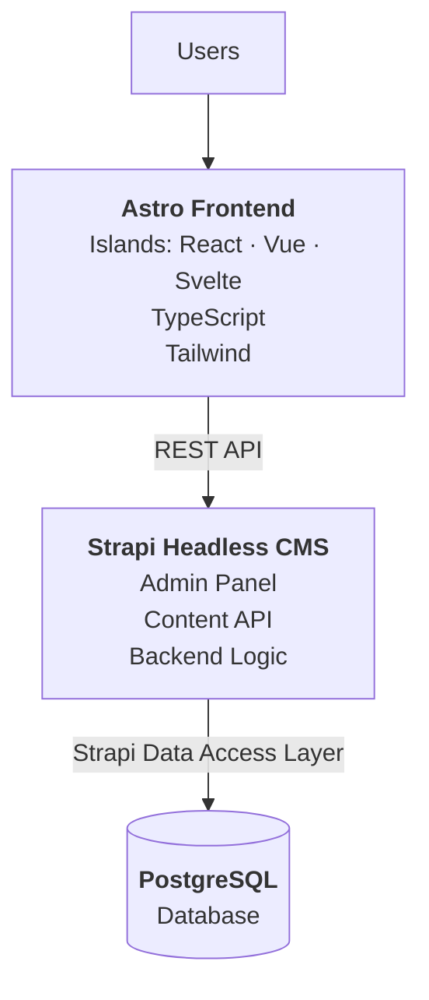
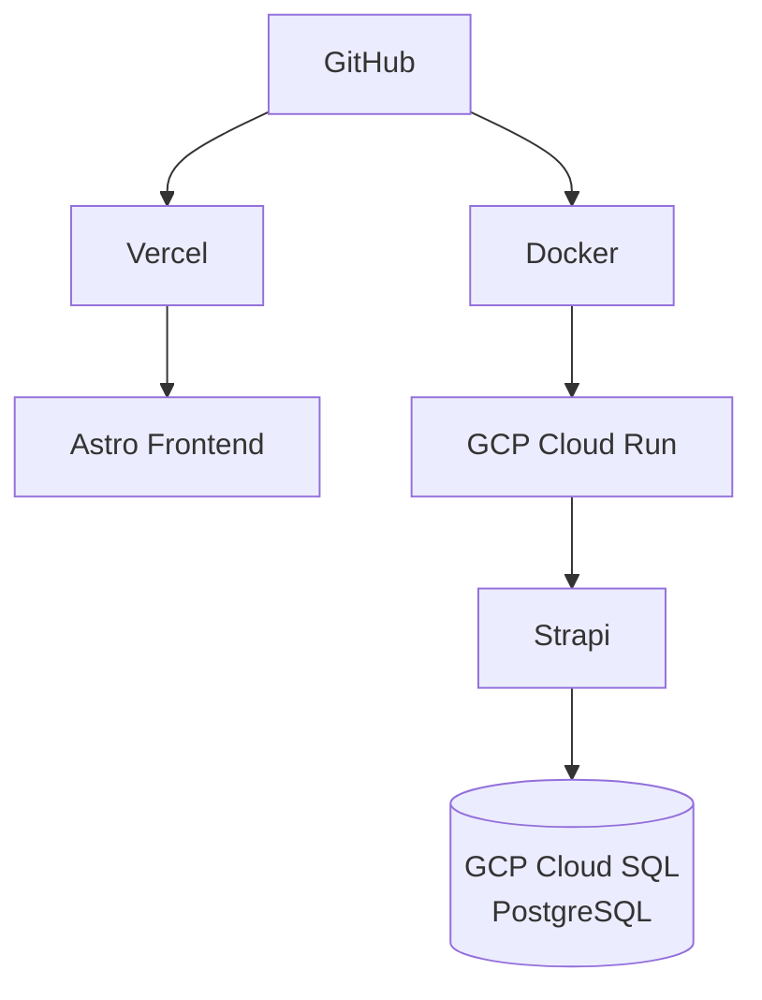

# Fullstack Headless CMS

[](https://astro.build)
[](https://react.dev)
[](https://vuejs.org)
[](https://svelte.dev)
[](https://www.typescriptlang.org)
[](https://tailwindcss.com)
[](https://strapi.io)
[](https://www.postgresql.org)
[](https://www.docker.com)
[](https://cloud.google.com)
[](https://vercel.com)

[English](README.md) · **Bahasa Indonesia**

Membangun Headless CMS / Knowledge Management System yang siap produksi sebagai proyek portofolio.

Proyek ini harus mendemonstrasikan Full-Stack Development dunia nyata menggunakan Astro, React, TypeScript, Strapi, REST API, PostgreSQL, Docker, dan Google Cloud Platform.

> [!IMPORTANT]
> **JANGAN** membuat seluruh aplikasi sekaligus.
>
> Mulai dari arsitektur dan setup proyek terlebih dahulu, jelaskan keputusannya, lalu implementasikan aplikasi selangkah demi selangkah.

---

## Daftar Isi

- [Gambaran Proyek](#gambaran-proyek)
- [Tech Stack](#tech-stack)
- [Arsitektur Sistem](#arsitektur-sistem)
- [Frontend Astro](#frontend-astro)
- [Islands](#islands)
- [Strapi Headless CMS](#strapi-headless-cms)
- [REST API](#rest-api)
- [Strategi Pengambilan Data](#strategi-pengambilan-data)
- [PostgreSQL](#postgresql)
- [TypeScript](#typescript)
- [Dokumentasi Modul](#dokumentasi-modul)
- [Struktur Proyek](#struktur-proyek)
- [Docker](#docker)
- [Pengembangan Lokal](#pengembangan-lokal)
- [Google Cloud Platform](#google-cloud-platform)
- [Vercel](#vercel)
- [Environment Variable](#environment-variable)
- [Git & GitHub](#git--github)
- [README](#readme)
- [Kualitas Kode](#kualitas-kode)
- [Proses Implementasi](#proses-implementasi)

---

## Gambaran Proyek

| | |
|---|---|
| **Jenis Proyek** | Headless CMS / Knowledge Management System |
| **Peran** | Full-Stack Developer |

**Tujuan Proyek**

Membangun platform manajemen konten modern di mana administrator dapat membuat, mengelola, dan mempublikasikan konten melalui Strapi Headless CMS.

Pengguna mengonsumsi konten yang dipublikasikan melalui frontend Astro yang cepat, responsif, dan SEO-friendly.

Proyek ini harus mendemonstrasikan:

- Arsitektur Headless CMS
- Arsitektur Astro yang berfokus pada konten
- Island yang framework-agnostic (React, Vue, Svelte)
- Integrasi REST API
- Persistensi PostgreSQL
- Kontainerisasi Docker
- Deployment ke cloud
- Arsitektur Full-Stack yang bersih

---

## Tech Stack

| Lapisan | Teknologi |
|---|---|
| **Frontend** | Astro · React · Vue · Svelte · TypeScript · Tailwind CSS |
| **Backend / CMS** | Strapi Headless CMS · REST API · TypeScript jika didukung |
| **Database** | PostgreSQL |
| **Infrastruktur** | Docker · Google Cloud Platform · Google Cloud Run · Google Cloud SQL for PostgreSQL |
| **Deployment Frontend** | Vercel |
| **Version Control** | Git · GitHub |

---

## Arsitektur Sistem

Gunakan arsitektur berikut:



**Arsitektur produksi**



> [!WARNING]
> Astro **TIDAK BOLEH** terhubung langsung ke PostgreSQL.

Semua akses konten harus mengikuti alur:

```text
Astro  ->  REST API  ->  Strapi  ->  PostgreSQL
```

---

## Frontend Astro

Gunakan Astro sebagai framework frontend utama.

**Kebutuhan**

- Halaman Astro untuk halaman yang berfokus pada konten
- TypeScript
- Tailwind CSS
- Komponen Astro yang reusable
- Layout yang reusable
- Dynamic routing
- Pengambilan data di sisi server jika sesuai
- HTML yang SEO-friendly
- Desain responsif
- JavaScript sisi klien seminimal mungkin
- Loading state, empty state, dan error state yang benar

Astro harus menangani sebagian besar UI yang bersifat statis/berorientasi konten.

---

## Islands

> [!IMPORTANT]
> Tidak ada UI framework yang boleh digunakan untuk seluruh aplikasi.

Gunakan React, Vue, atau Svelte hanya untuk komponen yang membutuhkan interaktivitas sisi klien melalui Astro Islands Architecture.

**Kandidat island yang baik**

- Search
- Filter artikel
- Filter kategori
- Filter tag
- Navigasi interaktif jika memang diperlukan

Jangan melakukan hidrasi komponen secara tidak perlu.

### Pembagian framework

Proyek ini sengaja menjalankan tiga integrasi UI framework untuk mendemonstrasikan bahwa island Astro bersifat framework-agnostic. Demonstrasi itu baru layak dilakukan kalau tidak membebani pengunjung sama sekali.

> [!WARNING]
> **Satu framework per halaman.** Tiap framework mengirim runtime-nya sendiri dan tidak ada yang dipakai bersama, jadi dua framework dalam satu halaman berarti pengunjung mengunduh keduanya. Island dari framework berbeda tidak boleh muncul di halaman yang sama.

Usulan pembagian — dikonfirmasi di [Fase 5](#fase-5--islands):

| Halaman | Island | Framework |
|---|---|---|
| `/` | Penjelajah topik populer | Svelte |
| `/articles` | Filter kategori & tag | Vue |
| `/search` | Kotak pencarian + hasil langsung | React |
| `/articles/[slug]` · `/categories/[slug]` · `/tags/[slug]` · `/authors/[slug]` | tidak ada | — (0 kB JS) |

> [!CAUTION]
> Waspadai **island global**. Apa pun yang ada di header atau footer bersama — misalnya tombol navigasi mobile — akan muncul di semua halaman dan bertabrakan dengan ketiga framework sekaligus. Bangun interaktivitas di layout bersama sebagai komponen `.astro` dengan JavaScript biasa.

### Directive hidrasi

Pilih Astro client directive yang tepat sesuai kebutuhan komponen.

| Directive | Waktu hidrasi |
|---|---|
| `client:load` | Langsung saat halaman dimuat |
| `client:idle` | Saat browser sedang idle |
| `client:visible` | Saat komponen masuk ke viewport |

Jelaskan mengapa sebuah island membutuhkan hidrasi sisi klien sebelum menggunakannya.

---

## Strapi Headless CMS

Gunakan Strapi sebagai Headless CMS sekaligus lapisan backend.

**Strapi bertanggung jawab atas**

- Dashboard admin
- Manajemen konten
- Validasi konten
- Manajemen media
- REST API
- Relasi antar konten
- Akses database
- Logika bisnis backend jika diperlukan

Administrator mengelola konten melalui Strapi Admin Panel.

> [!NOTE]
> **JANGAN** membangun dashboard admin custom kecuali ada kebutuhan yang jelas.

---

## REST API

Gunakan Strapi REST API sebagai lapisan komunikasi antara Astro dan Strapi.

> [!IMPORTANT]
> **JANGAN** gunakan GraphQL.

Buat API service layer yang reusable di dalam aplikasi Astro.

Jangan menyebar pemanggilan `fetch()` di seluruh komponen UI.

**Contoh struktur**

```text
src/
  services/
    strapi/
      client.ts
      articles.ts
      authors.ts
      categories.ts
      tags.ts
```

**Buat fungsi API untuk**

- Mengambil featured articles
- Mengambil latest articles
- Mengambil semua artikel
- Mengambil artikel berdasarkan slug
- Mengambil artikel berdasarkan kategori
- Mengambil artikel berdasarkan tag
- Mengambil artikel terkait
- Mengambil informasi author
- Mencari artikel

---

## Strategi Pengambilan Data

Utamakan pengambilan data sisi server (server-side) Astro untuk konten.

**Contoh alur**

```text
Request halaman
    -> Astro
    -> Strapi REST API
    -> PostgreSQL
    -> Response Strapi
    -> Astro merender HTML
```

Jangan mengambil konten dari browser jika pengambilan di sisi server sudah mencukupi.

**Tujuan**

- SEO lebih baik
- JavaScript sisi klien lebih sedikit
- Rendering awal lebih cepat
- Arsitektur frontend lebih sederhana

Gunakan pengambilan data sisi klien hanya untuk fitur yang benar-benar membutuhkan interaktivitas.

---

## PostgreSQL

Gunakan PostgreSQL sebagai database utama Strapi.

> [!WARNING]
> - **JANGAN** menghubungkan Astro langsung ke PostgreSQL.
> - **JANGAN** menggunakan raw SQL untuk fungsionalitas aplikasi standar.
> - **JANGAN** membuat query SQL CRUD secara manual.

Gunakan kemampuan database/data access bawaan Strapi untuk:

- Membuat konten
- Membaca konten
- Memperbarui konten
- Menghapus konten
- Relasi
- Filtering
- Sorting
- Pagination

**Arsitektur database**

```text
Astro
    -> Strapi REST API
    -> Strapi Data Access Layer
    -> PostgreSQL
```

Untuk pengembangan lokal, PostgreSQL dapat dijalankan secara lokal atau melalui Docker.

Untuk produksi, gunakan Google Cloud SQL for PostgreSQL.

---

## TypeScript

Buat type/interface TypeScript yang benar untuk response Strapi.

**Contoh**

`Article` · `Author` · `Category` · `Tag` · `SEO` · `StrapiResponse` · `Pagination`

Hindari penggunaan `any` kecuali benar-benar diperlukan.

Pisahkan tipe response API dari props komponen UI jika memang sesuai.

---

## Dokumentasi Modul

| Modul | Dokumentasi |
|---|---|
| **Frontend** (Astro) | [`frontend/README.id.md`](frontend/README.id.md) — fitur utama, SEO, penanganan error |
| **Backend** (Strapi) | [`backend/README.id.md`](backend/README.id.md) — content model, relasi, admin, CORS & keamanan |

---

## Struktur Proyek

Utamakan struktur monorepo:

```text
root/
├── frontend/           # Astro
├── backend/            # Strapi
├── README.md
├── .gitignore
└── docker-compose.yml
```

**Struktur Astro yang direkomendasikan**

```text
frontend/
└── src/
    ├── components/
    │   ├── astro/
    │   ├── react/
    │   ├── vue/
    │   └── svelte/
    ├── layouts/
    ├── pages/
    │   ├── articles/
    │   ├── categories/
    │   ├── tags/
    │   └── authors/
    ├── services/
    │   └── strapi/
    ├── types/
    ├── utils/
    ├── styles/
    └── config/
```

Jaga pemisahan tanggung jawab.

Jangan membuat abstraksi yang tidak perlu.

---

## Docker

Kontainerisasi backend Strapi.

**Buat**

```text
backend/
├── Dockerfile
└── .dockerignore
```

**Docker image harus**

- Menjalankan Strapi dengan benar
- Layak untuk produksi
- Menggunakan environment variable
- Tidak memuat secret
- Menghindari file yang tidak perlu
- Menghindari development dependency yang tidak perlu di produksi

Gunakan multi-stage Docker build jika memberikan manfaat nyata.

Jelaskan keputusan Docker yang diambil.

---

## Pengembangan Lokal

Sediakan `docker-compose.yml` untuk pengembangan lokal jika bermanfaat.

Isinya dapat mencakup:

- Strapi
- PostgreSQL

Astro dapat dijalankan langsung menggunakan environment Node.js lokal, kecuali kontainerisasi memberikan manfaat yang jelas.

**Contoh arsitektur lokal**

```text
Astro localhost
      -> Strapi container
      -> PostgreSQL container
```

---

## Google Cloud Platform

| Aspek | Setup |
|---|---|
| **Backend produksi** | Strapi → Docker → Google Cloud Run |
| **Database produksi** | Google Cloud SQL → PostgreSQL |
| **Konektivitas** | Cloud Run → Cloud SQL (aman) |

**Kebutuhan**

- Jangan menuliskan kredensial GCP secara hardcode.
- Jangan mengekspos PostgreSQL ke publik kecuali diperlukan.
- Gunakan environment variable/secret.
- Konfigurasikan koneksi database produksi secara aman.
- Konfigurasikan Cloud Run untuk Strapi.
- Konfigurasikan environment produksi Strapi dengan benar.

Jaga arsitektur GCP tetap sederhana, sesuai untuk proyek portofolio.

---

## Vercel

Deploy frontend Astro ke Vercel.

Konfigurasikan URL Strapi API produksi melalui environment variable.

```bash
STRAPI_API_URL=https://api.example.com
```

**Alur produksi Astro**

```text
User
 -> Vercel
 -> Astro
 -> HTTPS REST API
 -> Strapi Cloud Run
 -> Cloud SQL PostgreSQL
```

---

## Environment Variable

> [!CAUTION]
> Jangan pernah menuliskan secret secara hardcode. File `.env` yang sebenarnya tidak boleh di-commit ke Git.

**Frontend** — `frontend/.env.example`

```bash
STRAPI_API_URL=
PUBLIC_SITE_URL=
```

**Backend** — `backend/.env.example`

```bash
HOST=
PORT=

APP_KEYS=
API_TOKEN_SALT=
ADMIN_JWT_SECRET=
TRANSFER_TOKEN_SALT=
JWT_SECRET=

DATABASE_CLIENT=postgres
DATABASE_HOST=
DATABASE_PORT=
DATABASE_NAME=
DATABASE_USERNAME=
DATABASE_PASSWORD=
DATABASE_SSL=
```

---

## Git & GitHub

Gunakan Git untuk version control.

<table>
<tr><th>Repository harus memuat</th><th>Jangan pernah commit</th></tr>
<tr><td valign="top">

- Riwayat commit yang jelas
- `.gitignore`
- README
- `.env.example`
- Dokumentasi setup
- Dokumentasi arsitektur
- Dokumentasi deployment

</td><td valign="top">

- `.env`
- `node_modules`
- kredensial database
- kredensial GCP
- secret API

</td></tr>
</table>

---

## README

Buat README profesional yang memuat:

| # | Bagian | # | Bagian |
|---|---|---|---|
| 1 | Gambaran proyek | 9 | Setup Strapi |
| 2 | Tujuan proyek | 10 | Setup PostgreSQL |
| 3 | Arsitektur | 11 | Setup Docker |
| 4 | Tech stack | 12 | Arsitektur deployment |
| 5 | Fitur | 13 | Deployment Vercel |
| 6 | Screenshot | 14 | Deployment GCP Cloud Run |
| 7 | Instalasi lokal | 15 | Konfigurasi Cloud SQL |
| 8 | Environment variable | | |

---

## Kualitas Kode

**Ikuti best practice untuk**

Astro · React · TypeScript · Strapi · REST API · PostgreSQL · Docker

<table>
<tr><th>✅ Prioritaskan</th><th>❌ Hindari</th></tr>
<tr><td valign="top">

- Keterbacaan
- Kemudahan pemeliharaan
- Reusability
- Pemisahan tanggung jawab
- TypeScript typing yang kuat
- JavaScript sisi klien seminimal mungkin
- Dependensi seminimal mungkin

</td><td valign="top">

- Over-engineering
- State management yang tidak perlu
- Komponen React yang tidak perlu
- Abstraksi yang tidak perlu
- Raw SQL untuk CRUD biasa
- Akses langsung dari frontend ke database

</td></tr>
</table>

---

## Proses Implementasi

> [!IMPORTANT]
> **JANGAN** membangun semuanya sekaligus. Kerjakan secara bertahap.
>
> Sebelum menghasilkan kode, jelaskan apa yang akan diimplementasikan dan alasannya.

| Fase | Fokus |
|---|---|
| [1](#fase-1--arsitektur) | Arsitektur |
| [2](#fase-2--inisialisasi) | Inisialisasi |
| [3](#fase-3--strapi) | Strapi |
| [4](#fase-4--astro) | Astro |
| [5](#fase-5--islands) | Islands |
| [6](#fase-6--penanganan-error) | Penanganan Error |
| [7](#fase-7--docker) | Docker |
| [8](#fase-8--deployment) | Deployment |
| [9](#fase-9--review-produksi) | Review Produksi |
| [10](#fase-10--persiapan-portofolio) | Persiapan Portofolio |

### Fase 1 — Arsitektur

Sebelum menulis kode aplikasi:

1. Jelaskan arsitektur secara lengkap.
2. Usulkan struktur folder monorepo.
3. Daftarkan dependensi yang dibutuhkan.
4. Definisikan content model Strapi.
5. Definisikan relasi konten.
6. Jelaskan pembagian tanggung jawab Astro vs React Island.
7. Definisikan strategi integrasi REST API.
8. Definisikan konfigurasi PostgreSQL.
9. Jelaskan arsitektur Docker.
10. Jelaskan arsitektur GCP Cloud Run + Cloud SQL.
11. Jelaskan arsitektur deployment Vercel.

> [!IMPORTANT]
> **BERHENTI setelah Fase 1.** Tunggu persetujuan saya sebelum implementasi.

### Fase 2 — Inisialisasi

Inisialisasi:

- Monorepo
- Frontend Astro
- Backend Strapi
- TypeScript
- Tailwind
- PostgreSQL
- Konfigurasi environment

### Fase 3 — Strapi

Implementasikan:

- Article
- Author
- Category
- Tag
- Komponen SEO
- Relasi
- Media
- Permission
- REST API

### Fase 4 — Astro

Implementasikan:

- Layout
- Homepage
- Daftar artikel
- Detail artikel
- Halaman kategori
- Halaman tag
- Halaman author
- SEO
- REST API service layer

### Fase 5 — Islands

Implementasikan hanya fungsionalitas interaktif:

- Search
- Filtering
- Komponen interaktif lain yang memang beralasan

Jelaskan strategi hidrasinya dan konfirmasi pembagian frameworknya.

### Fase 6 — Penanganan Error

Implementasikan:

- Loading state
- Empty state
- Error state
- 404
- Penanganan kegagalan API

### Fase 7 — Docker

Kontainerisasi Strapi.

Buat:

- `Dockerfile`
- `.dockerignore`
- `docker-compose.yml` jika bermanfaat

Uji Strapi + PostgreSQL secara lokal.

### Fase 8 — Deployment

Deploy:

| Komponen | Target |
|---|---|
| Astro | Vercel |
| Strapi | Docker → GCP Cloud Run |
| PostgreSQL | GCP Cloud SQL |

### Fase 9 — Review Produksi

Review:

- Performa
- SEO
- Aksesibilitas
- Keamanan
- Desain responsif
- Kualitas TypeScript
- Arsitektur REST API
- Hidrasi Astro
- Docker image
- Environment produksi
- Penanganan error

### Fase 10 — Persiapan Portofolio

Setelah aplikasi selesai, buat deskripsi teknis proyek yang ringkas untuk portofolio saya, mencakup:

- Tujuan proyek
- Peran saya sebagai Full-Stack Developer
- Arsitektur Astro
- Alasan memilih Astro
- Integrasi Astro + Strapi
- Strategi pengambilan data REST API
- Penggunaan PostgreSQL
- Islands (React, Vue, Svelte)
- Docker
- Deployment GCP
- Tantangan yang dihadapi
- Solusi yang diterapkan

> [!CAUTION]
> Jangan mengklaim fungsionalitas yang tidak benar-benar diimplementasikan.
