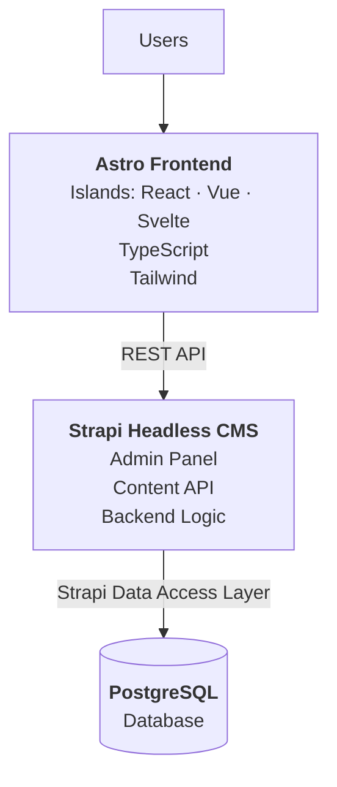
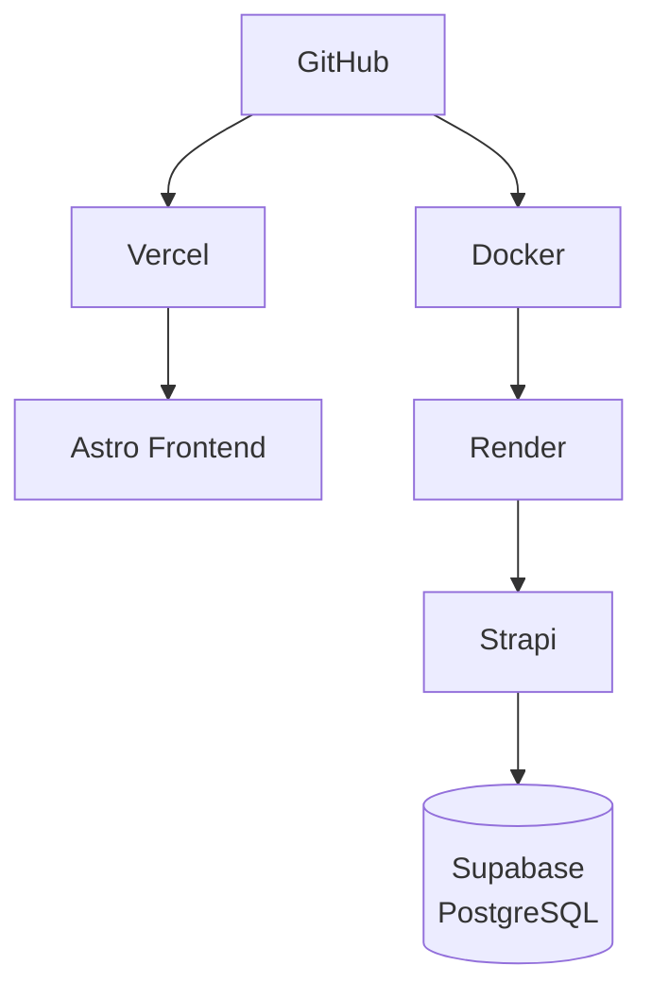

# Fullstack Headless CMS

[](https://astro.build)
[](https://react.dev)
[](https://vuejs.org)
[](https://svelte.dev)
[](https://www.typescriptlang.org)
[](https://tailwindcss.com)
[](https://strapi.io)
[](https://www.postgresql.org)
[](https://www.docker.com)
[](https://render.com)
[](https://vercel.com)

**English** · [Bahasa Indonesia](README.id.md)

Build a production-ready Headless CMS / Knowledge Management System as a portfolio project.

The project should demonstrate real-world Full-Stack Development using Astro, React, TypeScript, Strapi, REST API, PostgreSQL, Docker, and Render.

> [!IMPORTANT]
> Do **NOT** generate the entire application at once.
>
> Start with architecture and project setup first, explain the decisions, and implement the application step by step.

---

## Table of Contents

- [Project Overview](#project-overview)
- [Tech Stack](#tech-stack)
- [System Architecture](#system-architecture)
- [Astro Frontend](#astro-frontend)
- [Islands](#islands)
- [Strapi Headless CMS](#strapi-headless-cms)
- [REST API](#rest-api)
- [Data Fetching Strategy](#data-fetching-strategy)
- [PostgreSQL](#postgresql)
- [TypeScript](#typescript)
- [Module Documentation](#module-documentation)
- [Project Structure](#project-structure)
- [Docker](#docker)
- [Local Development](#local-development)
- [Render](#render)
- [Vercel](#vercel)
- [Environment Variables](#environment-variables)
- [Git & GitHub](#git--github)
- [README](#readme)
- [Code Quality](#code-quality)
- [Implementation Process](#implementation-process)

---

## Project Overview

| | |
|---|---|
| **Project Type** | Headless CMS / Knowledge Management System |
| **Role** | Full-Stack Developer |

**Project Goal**

Build a modern content management platform where administrators can create, manage, and publish content through Strapi Headless CMS.

Users consume the published content through a fast, responsive, and SEO-friendly Astro frontend.

The project should demonstrate:

- Headless CMS architecture
- Astro content-focused architecture
- Framework-agnostic islands (React, Vue, Svelte)
- REST API integration
- PostgreSQL persistence
- Docker containerization
- Cloud deployment
- Clean Full-Stack architecture

---

## Tech Stack

| Layer | Technology |
|---|---|
| **Frontend** | Astro · React · Vue · Svelte · TypeScript · Tailwind CSS |
| **Backend / CMS** | Strapi Headless CMS · REST API · TypeScript where supported |
| **Database** | PostgreSQL |
| **Infrastructure** | Docker · Render · Render |
| **Database hosting** | Supabase (managed PostgreSQL) — see D9 in [`docs/ARCHITECTURE.md`](docs/ARCHITECTURE.md) |
| **Frontend Deployment** | Vercel |
| **Version Control** | Git · GitHub |

---

## System Architecture

Use the following architecture:



**Production architecture**



> [!WARNING]
> Astro must **NEVER** connect directly to PostgreSQL.

All content access must follow:

```text
Astro  ->  REST API  ->  Strapi  ->  PostgreSQL
```

---

## Astro Frontend

Use Astro as the primary frontend framework.

**Requirements**

- Astro pages for content-focused pages
- TypeScript
- Tailwind CSS
- Reusable Astro components
- Reusable layouts
- Dynamic routing
- Server-side data fetching where appropriate
- SEO-friendly HTML
- Responsive design
- Minimal client-side JavaScript
- Proper loading, empty, and error states

Astro should handle most static/content-oriented UI.

---

## Islands

> [!IMPORTANT]
> No UI framework may be used for the entire application.

Use React, Vue, or Svelte only for components requiring client-side interactivity through Astro Islands Architecture.

**Good island candidates**

- Search
- Article filtering
- Category filtering
- Tag filtering
- Interactive navigation if necessary

Do not hydrate components unnecessarily.

### Framework allocation

This project runs three UI framework integrations on purpose, to demonstrate that Astro's islands are framework-agnostic. That demonstration is only worth making if it costs the visitor nothing.

> [!WARNING]
> **One framework per page.** Each framework ships its own runtime and none of it is shared between them, so two frameworks on one page means the visitor downloads both. Islands built with different frameworks must never appear on the same page.

Measured allocation:

| Page | Island | Framework | JS shipped (gzip) |
|---|---|---|---|
| `/search` | Search box + live results | React | 60.4 kB |
| `/articles` | Category & tag filter | Vue | 29.3 kB |
| `/articles/[slug]` | Table of contents, reading progress, copy-code | Svelte | 16.1 kB |
| `/` | — | — | **0 kB** |
| `/categories/[slug]` | — | — | **0 kB** |
| `/tags/[slug]` | — | — | **0 kB** |
| `/authors/[slug]` | — | — | **0 kB** |
| `/404` | — | — | **0 kB** |

Those figures are measured from the build output, not estimated. They are also the reason each framework sits where it does: the article page is the one visitors actually read, so it gets the lightest runtime available. React on that page would cost roughly four times as much.

> [!CAUTION]
> Watch for **global islands**. Anything in the shared header or footer — a mobile navigation toggle, for instance — appears on every page and would collide with all three frameworks at once. Build shared-layout interactivity as an `.astro` component with plain JavaScript instead.

### Hydration directives

Choose the appropriate Astro client directive based on the component requirements.

| Directive | Hydrates |
|---|---|
| `client:load` | Immediately on page load |
| `client:idle` | When the browser is idle |
| `client:visible` | When the component enters the viewport |

Explain why an island requires client-side hydration before using one.

---

## Strapi Headless CMS

Use Strapi as the Headless CMS and backend layer.

**Strapi is responsible for**

- Admin dashboard
- Content management
- Content validation
- Media management
- REST API
- Content relationships
- Database access
- Backend business logic where required

Administrators should manage content through the Strapi Admin Panel.

> [!NOTE]
> Do **NOT** build a custom admin dashboard unless there is a clear requirement.

---

## REST API

Use Strapi REST API as the communication layer between Astro and Strapi.

> [!IMPORTANT]
> Do **NOT** use GraphQL.

Create a reusable API service layer in the Astro application.

Do not scatter `fetch()` calls throughout UI components.

**Example structure**

```text
src/
  services/
    strapi/
      client.ts
      articles.ts
      authors.ts
      categories.ts
      tags.ts
```

**Create API functions for**

- Get featured articles
- Get latest articles
- Get all articles
- Get article by slug
- Get articles by category
- Get articles by tag
- Get related articles
- Get author information
- Search articles

---

## Data Fetching Strategy

Prefer Astro server-side data fetching for content.

**Example flow**

```text
Request page
    -> Astro
    -> Strapi REST API
    -> PostgreSQL
    -> Strapi Response
    -> Astro renders HTML
```

Do not fetch content from the browser when server-side fetching is sufficient.

**Goals**

- Better SEO
- Less client-side JavaScript
- Faster initial rendering
- Simpler frontend architecture

Use client-side fetching only for features that genuinely require interactivity.

---

## PostgreSQL

Use PostgreSQL as Strapi's primary database.

> [!WARNING]
> - Do **NOT** connect Astro directly to PostgreSQL.
> - Do **NOT** use raw SQL for standard application functionality.
> - Do **NOT** manually create CRUD SQL queries.

Use Strapi's built-in database/data access capabilities for:

- Creating content
- Reading content
- Updating content
- Deleting content
- Relationships
- Filtering
- Sorting
- Pagination

**Database architecture**

```text
Astro
    -> Strapi REST API
    -> Strapi Data Access Layer
    -> PostgreSQL
```

For local development, PostgreSQL may run locally or through Docker.

The same Supabase database serves development and production; there is no separate production instance.

---

## TypeScript

Create proper TypeScript types/interfaces for Strapi responses.

**Examples**

`Article` · `Author` · `Category` · `Tag` · `SEO` · `StrapiResponse` · `Pagination`

Avoid using `any` unless absolutely necessary.

Keep API response types separate from UI component props when appropriate.

---

## Module Documentation

| Module | Documentation |
|---|---|
| **Frontend** (Astro) | [`frontend/README.md`](frontend/README.md) — core features, SEO, error handling |
| **Backend** (Strapi) | [`backend/README.md`](backend/README.md) — content models, relationships, admin, CORS & security |
| **Architecture** | [`docs/ARCHITECTURE.md`](docs/ARCHITECTURE.md) — Phase 1: full architecture, decisions and rationale |

---

## Project Structure

Prefer a monorepo structure:

```text
root/
├── frontend/           # Astro
├── backend/            # Strapi
├── README.md
├── .gitignore
└── docker-compose.yml
```

**Recommended Astro structure**

```text
frontend/
└── src/
    ├── components/
    │   ├── astro/          # 14 components, 0 kB JS
    │   ├── react/          # SearchBox.tsx      → /search
    │   ├── vue/            # ArticleFilter.vue  → /articles
    │   └── svelte/         # ReadingTools.svelte → /articles/[slug]
    ├── layouts/            # BaseLayout: feed | article | plain
    ├── pages/
    │   ├── index.astro
    │   ├── search.astro    # prerender = false
    │   ├── 404.astro
    │   ├── api/search.ts   # prerender = false
    │   ├── articles/       # index, [slug], page/[page]
    │   ├── categories/[slug].astro
    │   ├── tags/[slug].astro
    │   └── authors/[slug].astro
    ├── services/strapi/    # client, query, articles, authors, categories, tags
    ├── types/
    ├── utils/              # date.ts, markdown.ts
    ├── styles/
    └── config/
```

Keep responsibilities separated.

Do not create unnecessary abstractions.

---

## Docker

Containerize the Strapi backend.

**Create**

```text
backend/
├── Dockerfile
└── .dockerignore
```

**The Docker image must**

- Run Strapi correctly
- Be suitable for production
- Use environment variables
- Not contain secrets
- Avoid unnecessary files
- Avoid unnecessary development dependencies in production

Use a multi-stage Docker build if it provides a real benefit.

Explain Docker decisions.

---

## Local Development

Provide `docker-compose.yml` for local development when useful.

It may contain:

- Strapi
- PostgreSQL

Astro can run directly using the local Node.js environment unless containerizing it provides a clear benefit.

**Example local architecture**

```text
Astro localhost
      -> Strapi container
      -> PostgreSQL container
```

---

## Render

| Concern | Setup |
|---|---|
| **Production backend** | Strapi → Docker → Render |
| **Production database** | Supabase PostgreSQL (session pooler, TLS) |
| **Connectivity** | Render → Supabase over TLS |

**Requirements**

- Never hardcode credentials; every secret is an environment variable in the Render dashboard.
- Set **Root Directory** to `backend` — the repo has no `package.json` at its root.
- Leave `PORT` unset; Render injects it and `config/server.ts` reads it.
- Keep the container stateless — database on Supabase, media on Cloudinary.
- Account for the free tier sleeping: see the retry behaviour in `services/strapi/client.ts`.

Keep the deployment simple enough for a portfolio project.

---

## Vercel

Deploy the Astro frontend to Vercel.

Configure the production Strapi API URL through environment variables.

```bash
STRAPI_API_URL=https://api.example.com
```

**Astro production flow**

```text
User
 -> Vercel
 -> Astro
 -> HTTPS REST API
 -> Strapi di Render
 -> Supabase PostgreSQL
```

---

## Environment Variables

> [!CAUTION]
> Never hardcode secrets. Actual `.env` files must never be committed to Git.

**Frontend** — `frontend/.env.example`

```bash
STRAPI_API_URL=
PUBLIC_SITE_URL=
```

**Backend** — `backend/.env.example`

```bash
HOST=
PORT=

APP_KEYS=
API_TOKEN_SALT=
ADMIN_JWT_SECRET=
TRANSFER_TOKEN_SALT=
JWT_SECRET=

DATABASE_CLIENT=postgres
DATABASE_HOST=
DATABASE_PORT=
DATABASE_NAME=
DATABASE_USERNAME=
DATABASE_PASSWORD=
DATABASE_SSL=
```

---

## Git & GitHub

Use Git for version control.

<table>
<tr><th>Repository should contain</th><th>Never commit</th></tr>
<tr><td valign="top">

- Clear commit history
- `.gitignore`
- README
- `.env.example`
- Setup documentation
- Architecture documentation
- Deployment documentation

</td><td valign="top">

- `.env`
- `node_modules`
- database credentials
- deployment credentials
- API secrets

</td></tr>
</table>

---

## README

Create a professional README containing:

| # | Section | # | Section |
|---|---|---|---|
| 1 | Project overview | 9 | Strapi setup |
| 2 | Project goal | 10 | PostgreSQL setup |
| 3 | Architecture | 11 | Docker setup |
| 4 | Tech stack | 12 | Deployment architecture |
| 5 | Features | 13 | Vercel deployment |
| 6 | Screenshots | 14 | Render deployment |
| 7 | Local installation | 15 | Database configuration |
| 8 | Environment variables | | |

---

## Code Quality

**Follow best practices for**

Astro · React · TypeScript · Strapi · REST API · PostgreSQL · Docker

<table>
<tr><th>✅ Prioritize</th><th>❌ Avoid</th></tr>
<tr><td valign="top">

- Readability
- Maintainability
- Reusability
- Separation of concerns
- Strong TypeScript typing
- Minimal client-side JavaScript
- Minimal dependencies

</td><td valign="top">

- Over-engineering
- Unnecessary state management
- Unnecessary React components
- Unnecessary abstractions
- Raw SQL for normal CRUD
- Direct frontend-to-database access

</td></tr>
</table>

---

## Implementation Process

> [!IMPORTANT]
> Do **NOT** build everything immediately. Work incrementally.
>
> Before generating code, explain what will be implemented and why.

| Phase | Focus | Status |
|---|---|---|
| [1](#phase-1--architecture) | Architecture | ✅ Done |
| [2](#phase-2--initialization) | Initialization | ✅ Done |
| [3](#phase-3--strapi) | Strapi | ✅ Done |
| [4](#phase-4--astro) | Astro | ✅ Done |
| [5](#phase-5--islands) | Islands | ✅ Done |
| [6](#phase-6--error-handling) | Error Handling | ✅ Done |
| [7](#phase-7--docker) | Docker | 🔄 Next |
| [8](#phase-8--deployment) | Deployment | ⬜ Not started |
| [9](#phase-9--production-review) | Production Review | ⬜ Not started |
| [10](#phase-10--portfolio-preparation) | Portfolio Preparation | ⬜ Not started |

> [!NOTE]
> A phase is finished only when every box under it is ticked. Do not start the next phase before then — the checklist is the scope boundary, not a suggestion.

### Phase 1 — Architecture

Before writing application code:

- [x] Explain the complete architecture.
- [x] Propose the monorepo folder structure.
- [x] List required dependencies.
- [x] Define Strapi content models.
- [x] Define content relationships.
- [x] Explain Astro vs island responsibilities.
- [x] Define the REST API integration strategy.
- [x] Define PostgreSQL configuration.
- [x] Explain Docker architecture.
- [x] Explain Render architecture.
- [x] Explain Vercel deployment architecture.

> [!IMPORTANT]
> **STOP after Phase 1.** Wait for my approval before implementation.

### Phase 2 — Initialization

Initialize:

- [x] Monorepo
- [x] Astro frontend
- [x] Strapi backend
- [x] TypeScript
- [x] Tailwind
- [x] PostgreSQL
- [x] Environment configuration

### Phase 3 — Strapi

Implement:

- [x] Article
- [x] Author
- [x] Category
- [x] Tag
- [x] SEO component
- [x] Relationships
- [x] Media
- [x] Permissions
- [x] REST API

### Phase 4 — Astro

Implement:

- [x] Layouts
- [x] Homepage
- [x] Article listing
- [x] Article detail
- [x] Category page
- [x] Tag page
- [x] Author page
- [x] SEO
- [x] REST API service layer

### Phase 5 — Islands

Implement only interactive functionality:

- [x] Search
- [x] Filtering
- [x] Other justified interactive components

Explain the hydration strategy and confirm the framework allocation.

### Phase 6 — Error Handling

Implement:

- [x] Loading states
- [x] Empty states
- [x] Error states
- [x] 404
- [x] API failure handling

### Phase 7 — Docker

Containerize Strapi.

Create:

- [x] `Dockerfile`
- [x] `.dockerignore`
- [x] `docker-compose.yml` where useful

Test Strapi + PostgreSQL locally.

> [!NOTE]
> The image is built by Render during deployment rather than on a developer machine, so the Dockerfile is first exercised in Phase 8. `docker-compose.yml` carries no Postgres service — the project uses one managed Supabase database for both environments.

### Phase 8 — Deployment

Deploy:

| Component | Target |
|---|---|
| Astro | Vercel |
| Strapi | Docker → Render |
| PostgreSQL | Supabase (already live) |

### Phase 9 — Production Review

Review:

- [ ] Performance
- [ ] SEO
- [ ] Accessibility
- [ ] Security
- [ ] Responsive design
- [ ] TypeScript quality
- [ ] REST API architecture
- [ ] Astro hydration
- [ ] Docker image
- [ ] Production environment
- [ ] Error handling

### Phase 10 — Portfolio Preparation

After the application is complete, generate a concise technical project description for my portfolio covering:

- [ ] Project goal
- [ ] My role as Full-Stack Developer
- [ ] Astro architecture
- [ ] Why Astro was chosen
- [ ] Astro + Strapi integration
- [ ] REST API data fetching strategy
- [ ] PostgreSQL usage
- [ ] Islands (React, Vue, Svelte)
- [ ] Docker
- [ ] Render deployment
- [ ] Challenges faced
- [ ] Solutions implemented

> [!CAUTION]
> Do not claim functionality that was not actually implemented.
