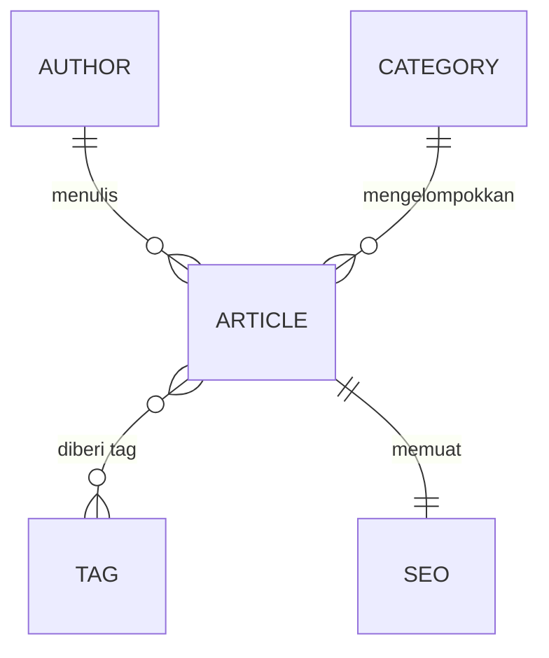

# Backend — Strapi

[](https://strapi.io)
[](https://www.postgresql.org)
[](https://www.docker.com)
[](https://cloud.google.com)

[English](README.md) · **Bahasa Indonesia**

Backend Strapi untuk [Fullstack Headless CMS](../README.id.md) — lapisan Headless CMS yang memegang manajemen konten, REST API, dan akses database.

> [!NOTE]
> Konteks lintas-modul — tujuan, arsitektur sistem, tech stack, environment variable, kualitas kode, dan fase implementasi — ada di [README root](../README.id.md).

---

## Daftar Isi

- [Content Model](#content-model)
- [Relasi Konten](#relasi-konten)
- [Strapi Admin](#strapi-admin)
- [CORS & Keamanan](#cors--keamanan)

---

## Content Model

Buat content type Strapi berikut.

### 1. Article

`title` · `slug` · `excerpt` · `content` · `coverImage` · `featured` · `publishedAt` · `author` · `category` · `tags` · `seo`

### 2. Author

`name` · `slug` · `avatar` · `bio`

### 3. Category

`name` · `slug` · `description`

### 4. Tag

`name` · `slug`

### 5. Komponen SEO

Komponen reusable yang berisi:

`metaTitle` · `metaDescription` · `keywords` · `canonicalURL` · `socialImage`

---

## Relasi Konten

Konfigurasikan relasi Strapi dengan benar.

| Content Type | Relasi |
|---|---|
| **Article** | dimiliki oleh satu Author<br/>dimiliki oleh satu Category<br/>dapat memiliki banyak Tag<br/>memuat satu komponen SEO |
| **Author** | dapat memiliki banyak Article |
| **Category** | dapat memiliki banyak Article |
| **Tag** | dapat dimiliki oleh banyak Article |



Gunakan penamaan relasi yang bermakna.

---

## Strapi Admin

Gunakan Strapi Admin Panel standar.

**Administrator harus dapat**

- Membuat artikel
- Mengedit artikel
- Menghapus artikel
- Publish/unpublish artikel
- Mengunggah gambar
- Mengelola author
- Mengelola kategori
- Mengelola tag
- Mengonfigurasi metadata SEO

Konfigurasikan role dan permission Strapi dengan tepat.

---

## CORS & Keamanan

Konfigurasikan CORS Strapi agar akses API produksi dibatasi dengan tepat.

```text
Frontend produksi:  Vercel  ->  Strapi Cloud Run
```

**Ikuti praktik keamanan dasar**

- Environment variable untuk secret
- Permission Strapi yang benar
- Batasi permission API publik yang tidak perlu
- Validasi input
- Jangan mengekspos kredensial
- Jangan mengekspos detail error internal
- Konfigurasikan CORS dengan benar
- Jaga dependensi tetap diperbarui
