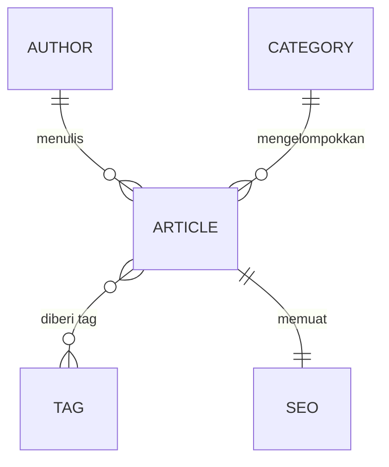

# Backend — Strapi

[](https://strapi.io)
[](https://www.postgresql.org)
[](https://www.docker.com)
[](https://render.com)

[English](README.md) · **Bahasa Indonesia**

Backend Strapi untuk [Fullstack Headless CMS](../README.id.md) — lapisan Headless CMS yang memegang manajemen konten, REST API, dan akses database.

> [!NOTE]
> Konteks lintas-modul — tujuan, arsitektur sistem, tech stack, environment variable, kualitas kode, dan fase implementasi — ada di [README root](../README.id.md).

---

## Daftar Isi

- [Content Model](#content-model)
- [Relasi Konten](#relasi-konten)
- [Strapi Admin](#strapi-admin)
- [CORS & Keamanan](#cors--keamanan)
- [Akses API publik](#akses-api-publik)
- [Konten contoh](#konten-contoh)

---

## Content Model

Buat content type Strapi berikut.

### 1. Article

`title` · `slug` · `excerpt` · `content` · `coverImage` · `featured` · `publishedAt` · `author` · `category` · `tags` · `seo`

### 2. Author

`name` · `slug` · `avatar` · `bio`

### 3. Category

`name` · `slug` · `description`

### 4. Tag

`name` · `slug`

### 5. Komponen SEO

Komponen reusable yang berisi:

`metaTitle` · `metaDescription` · `keywords` · `canonicalURL` · `socialImage`

---

## Relasi Konten

Konfigurasikan relasi Strapi dengan benar.

| Content Type | Relasi |
|---|---|
| **Article** | dimiliki oleh satu Author<br/>dimiliki oleh satu Category<br/>dapat memiliki banyak Tag<br/>memuat satu komponen SEO |
| **Author** | dapat memiliki banyak Article |
| **Category** | dapat memiliki banyak Article |
| **Tag** | dapat dimiliki oleh banyak Article |



Gunakan penamaan relasi yang bermakna.

---

## Strapi Admin

Gunakan Strapi Admin Panel standar.

**Administrator harus dapat**

- Membuat artikel
- Mengedit artikel
- Menghapus artikel
- Publish/unpublish artikel
- Mengunggah gambar
- Mengelola author
- Mengelola kategori
- Mengelola tag
- Mengonfigurasi metadata SEO

Konfigurasikan role dan permission Strapi dengan tepat.

---

## CORS & Keamanan

Konfigurasikan CORS Strapi agar akses API produksi dibatasi dengan tepat.

```text
Frontend produksi:  Vercel  ->  Strapi di Render
```

**Ikuti praktik keamanan dasar**

- Environment variable untuk secret
- Permission Strapi yang benar
- Batasi permission API publik yang tidak perlu
- Validasi input
- Jangan mengekspos kredensial
- Jangan mengekspos detail error internal
- Konfigurasikan CORS dengan benar
- Jaga dependensi tetap diperbarui

---

### Akses API publik

Content API **terbuka untuk dibaca**. Role Public di Strapi diberi `find` dan `findOne` pada Article, Author, Category, dan Tag — tidak lebih.

| Request | Role Public | Hasil |
|---|---|---|
| `GET /api/articles` | diizinkan | `200` |
| `GET /api/articles/:documentId` | diizinkan | `200` |
| `POST` / `PUT` / `DELETE` pada content type mana pun | tidak | `403` |
| `/api/auth/*` (login pengunjung) | tidak | `403` |

Pemberian izin itu dilakukan di [`src/index.ts`](src/index.ts) dalam `bootstrap()`, bukan dengan mencentang kotak di admin panel.

Alasannya, Strapi menyimpan permission di **database**, bukan di file. Izin yang dicentang di database lokal tidak ikut berpindah bersama kode — database yang belum pernah menjalankan kode ini akan start tanpa permission sama sekali, dan setiap request gagal `403` hanya di produksi, lama setelah perubahannya tampak benar di lokal. Menuliskannya sebagai kode membuat setelan ini masuk version control, bisa direview, dan sama persis di semua environment.

> [!NOTE]
> Baca terbuka berarti content API bisa dijangkau siapa pun yang menemukan URL-nya. Ini bukan kebocoran data — konten yang sama toh terbit di situs publik — tapi memungkinkan scraping, dan trafiknya bisa membangunkan backend. Untuk menutupnya, cabut pemberian izin di `bootstrap()` lalu berikan API token read-only ke Astro. Lihat D3 di [`docs/ARCHITECTURE.id.md`](../docs/ARCHITECTURE.id.md).

---

## Konten contoh

`scripts/seed.js` mengisi database kosong supaya frontend punya sesuatu untuk dirender.

```bash
npm run seed              # dilewati kalau sudah ada artikel
npm run seed -- --reset   # hapus dulu artikel, kategori, dan tag
```

Secara default idempoten: dijalankan dua kali tidak mengubah apa pun. `--reset` menghapus artikel, kategori, dan tag, tapi **mempertahankan author dan seluruh isi Media Library**, jadi gambar yang sudah diunggah tidak pernah ikut hilang.

Script ini mem-boot Strapi secara programatik lewat `compileStrapi()` dan menulis melalui Document Service, sehingga pasangan draft/terbit, komponen, dan relasi dibuat persis seperti kalau lewat admin panel.
