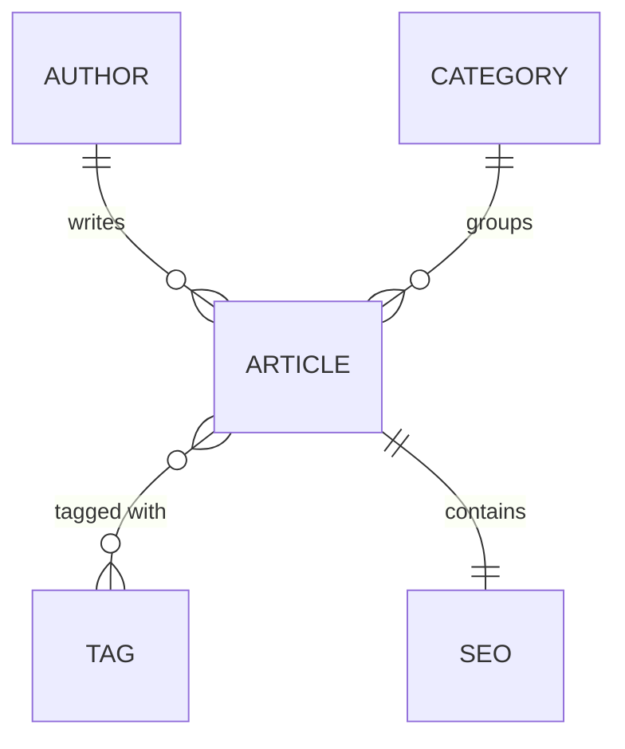

# Backend — Strapi

[](https://strapi.io)
[](https://www.postgresql.org)
[](https://www.docker.com)
[](https://cloud.google.com)

**English** · [Bahasa Indonesia](README.id.md)

Strapi backend for the [Fullstack Headless CMS](../README.md) — the Headless CMS layer that owns content management, the REST API, and database access.

> [!NOTE]
> Project-wide context — goal, system architecture, tech stack, environment variables, code quality, and the implementation phases — lives in the [root README](../README.md).

---

## Table of Contents

- [Content Models](#content-models)
- [Content Relationships](#content-relationships)
- [Strapi Admin](#strapi-admin)
- [CORS & Security](#cors--security)

---

## Content Models

Create the following Strapi content types.

### 1. Article

`title` · `slug` · `excerpt` · `content` · `coverImage` · `featured` · `publishedAt` · `author` · `category` · `tags` · `seo`

### 2. Author

`name` · `slug` · `avatar` · `bio`

### 3. Category

`name` · `slug` · `description`

### 4. Tag

`name` · `slug`

### 5. SEO Component

Reusable component containing:

`metaTitle` · `metaDescription` · `keywords` · `canonicalURL` · `socialImage`

---

## Content Relationships

Configure proper Strapi relationships.

| Content Type | Relationship |
|---|---|
| **Article** | belongs to one Author<br/>belongs to one Category<br/>can have multiple Tags<br/>contains one SEO component |
| **Author** | can have multiple Articles |
| **Category** | can have multiple Articles |
| **Tag** | can belong to multiple Articles |



Use meaningful relationship names.

---

## Strapi Admin

Use the standard Strapi Admin Panel.

**Administrators should be able to**

- Create articles
- Edit articles
- Delete articles
- Publish/unpublish articles
- Upload images
- Manage authors
- Manage categories
- Manage tags
- Configure SEO metadata

Configure appropriate Strapi roles and permissions.

---

## CORS & Security

Configure Strapi CORS so that production API access is limited appropriately.

```text
Production frontend:  Vercel  ->  Strapi Cloud Run
```

**Follow basic security practices**

- Environment variables for secrets
- Proper Strapi permissions
- Restrict unnecessary public API permissions
- Validate input
- Do not expose credentials
- Do not expose internal error details
- Configure CORS properly
- Keep dependencies updated
