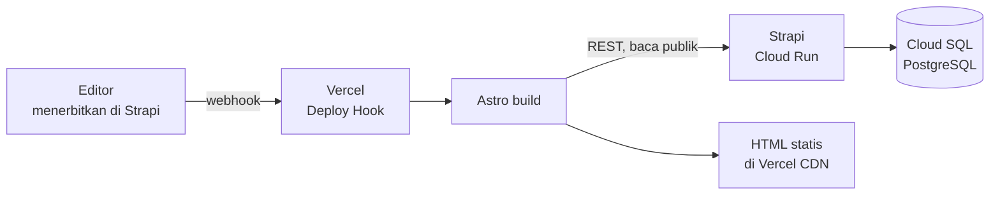
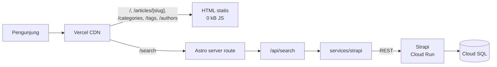
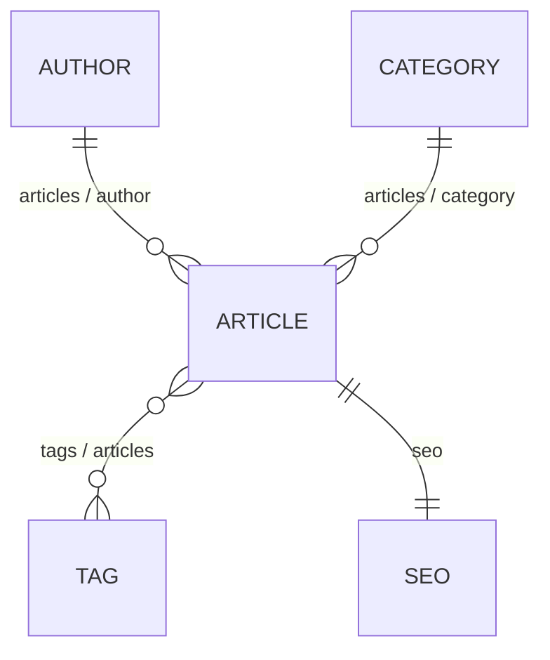

# Arsitektur — Fase 1

[English](ARCHITECTURE.md) · **Bahasa Indonesia**

Usulan arsitektur untuk [Fullstack Headless CMS](../README.id.md). Ini adalah keluaran Fase 1: keputusan dan alasannya saja.

> [!IMPORTANT]
> **Belum ada kode aplikasi yang ditulis.** Fase 2 (inisialisasi) baru dimulai setelah dokumen ini disetujui.

---

## Daftar Isi

- [0. Keputusan yang butuh persetujuanmu](#0-keputusan-yang-butuh-persetujuanmu)
- [1. Arsitektur lengkap](#1-arsitektur-lengkap)
- [2. Struktur monorepo](#2-struktur-monorepo)
- [3. Dependensi](#3-dependensi)
- [4. Content model](#4-content-model)
- [5. Relasi konten](#5-relasi-konten)
- [6. Pembagian tanggung jawab Astro vs island](#6-pembagian-tanggung-jawab-astro-vs-island)
- [7. Strategi integrasi REST API](#7-strategi-integrasi-rest-api)
- [8. Konfigurasi PostgreSQL](#8-konfigurasi-postgresql)
- [9. Arsitektur Docker](#9-arsitektur-docker)
- [10. GCP Cloud Run + Cloud SQL](#10-gcp-cloud-run--cloud-sql)
- [11. Deployment Vercel](#11-deployment-vercel)
- [Environment variable](#environment-variable)
- [Penghalang sebelum Fase 2](#penghalang-sebelum-fase-2)

---

## 0. Keputusan yang butuh persetujuanmu

Tujuh titik di mana saya harus memilih, atau di mana README root belum mengatur kasusnya. Tiga di antaranya mengubah `.env.example`.

| # | Keputusan | Usulan | Kenapa perlu diputuskan |
|---|---|---|---|
| D1 | **Mode rendering** | Halaman konten di-prerender saat build; hanya `/search` yang server-rendered | Menukar jeda terbit-ke-tayang (~1–3 menit rebuild) dengan biaya hosting nyaris nol dan TTFB terbaik |
| D2 | **Penyimpanan media** | Upload provider Cloudinary, bukan disk lokal Strapi | **Filesystem Cloud Run bersifat ephemeral — upload lokal hilang setiap kali restart.** Bukan opsional kalau gambar harus bertahan |
| D3 | **Akses baca Strapi** | Permission publik (`find`/`findOne` saja), dinyalakan di `bootstrap()`; tanpa API token | Lebih sederhana — tidak ada secret yang perlu dikelola — tapi content API bisa dibaca siapa pun yang menemukan URL-nya. Semua penulisan tetap tertutup |
| D4 | **Jalur data search** | Island → Astro `/api/search` → service layer → Strapi | Menjaga URL dan token Strapi tetap di server; tidak perlu membuka CORS ke browser |
| D5 | **Base image Docker** | `node:22-slim` (Debian), bukan Alpine | Dependensi `sharp` milik Strapi merepotkan dibangun di Alpine; biayanya image ~40 MB lebih besar |
| D6 | **Region Cloud Run** | `asia-southeast2` (Jakarta) | Latensi terendah untuk audiens Indonesia; alternatifnya `asia-southeast1` (Singapura) |
| D7 | **Versi Node** | Kunci Node 22 LTS lewat `.nvmrc` | Mesin ini memakai Node 24, di luar matriks dukungan Strapi 5 — lihat [Penghalang](#penghalang-sebelum-fase-2) |
| D8 | **Integrasi portofolio** | Disajikan sebagai `/blogs` di portofolio Next.js yang sudah ada lewat rewrite; tema disamakan | Menjaga aplikasi ini tetap berdiri sendiri, sehingga island dan service layer tetap terhitung sebagai karya portofolio. Alternatifnya — portofolio langsung fetch ke Strapi — akan membuang seluruh frontend ini |

D2 yang paling saya tekankan: itu masalah kebenaran, bukan preferensi. Sisanya trade-off yang wajar saja kalau kamu putuskan berbeda.

---

## 1. Arsitektur lengkap

Lima lapisan, masing-masing satu pemilik:

| Lapisan | Pemilik | Tanggung jawab |
|---|---|---|
| Penulisan | Strapi Admin Panel | Editor membuat, mengubah, menerbitkan konten |
| Persistensi | PostgreSQL lewat data layer Strapi | Menyimpan konten, relasi, metadata media |
| Pengiriman | Strapi REST API | Menyajikan konten terbit lewat HTTPS |
| Presentasi | Astro di Vercel | Merender HTML, memegang routing dan SEO |
| Interaktivitas | Island React / Vue / Svelte | Hanya search dan filter, satu framework per halaman |

### Saat build

Halaman konten dirender sekali, saat situs dibangun:



### Saat request

Mayoritas pengunjung tidak pernah menyentuh Strapi sama sekali:



Konsekuensi yang perlu disadari: karena halaman konten sudah di-prerender, **Cloud Run hanya menerima trafik saat build dan saat search**. Dia bisa turun ke nol instance, dan itulah sebabnya hosting ini praktis gratis.

### Batas kepercayaan

Browser tidak pernah memegang URL Strapi. URL itu hidup di environment sisi server Vercel, dipakai oleh proses build Astro dan oleh `/api/search`.

Role publik Strapi diberi tepat `find` dan `findOne` pada keempat content type, tidak lebih — setiap aksi penulisan mengembalikan 403. Pemberian izin itu ditulis di `src/index.ts` (`bootstrap()`), bukan diklik di admin panel, karena Strapi menyimpan permission di **database**, bukan di file: instance Cloud SQL yang baru akan start tanpa permission sama sekali, dan setiap request gagal 403 hanya di produksi.

> [!NOTE]
> Baca publik adalah trade-off yang disengaja. Ini bukan kebocoran data — konten yang sama toh tampil di situs publik — tapi content API jadi bisa dijangkau siapa pun yang menemukan URL-nya, terbuka untuk di-scrape, dan bisa membangunkan Cloud Run dengan trafik. Jalur peningkatannya adalah API token read-only: cabut pemberian izin di `bootstrap()`, lalu tambahkan `STRAPI_API_TOKEN` ke environment frontend.

Ini memenuhi aturan README root — Astro tidak pernah menyentuh PostgreSQL, dan setiap pembacaan mengikuti `Astro → REST → Strapi → PostgreSQL`.

---

## 2. Struktur monorepo

```text
fullstack-headless-cms/
├── frontend/                    # Astro
│   ├── src/
│   │   ├── components/
│   │   │   ├── astro/           # default — 0 kB JS
│   │   │   ├── react/           # island /search
│   │   │   ├── vue/             # island /articles
│   │   │   └── svelte/          # island /
│   │   ├── layouts/
│   │   ├── pages/
│   │   │   ├── index.astro
│   │   │   ├── search.astro
│   │   │   ├── 404.astro
│   │   │   ├── api/
│   │   │   │   └── search.ts    # server route, proxy untuk island
│   │   │   ├── articles/
│   │   │   │   ├── index.astro
│   │   │   │   └── [slug].astro
│   │   │   ├── categories/[slug].astro
│   │   │   ├── tags/[slug].astro
│   │   │   └── authors/[slug].astro
│   │   ├── services/strapi/     # satu-satunya tempat fetch() muncul
│   │   ├── types/
│   │   ├── utils/
│   │   ├── styles/
│   │   └── config/
│   ├── .env.example
│   ├── .nvmrc
│   └── astro.config.mjs
│
├── backend/                     # Strapi
│   ├── src/
│   │   ├── api/
│   │   │   ├── article/
│   │   │   ├── author/
│   │   │   ├── category/
│   │   │   └── tag/
│   │   └── components/shared/seo.json
│   ├── config/
│   │   ├── database.ts
│   │   ├── server.ts
│   │   ├── middlewares.ts       # CORS + CSP
│   │   └── plugins.ts           # upload provider
│   ├── .env.example
│   ├── .nvmrc
│   ├── Dockerfile
│   └── .dockerignore
│
├── docs/
├── docker-compose.yml           # Postgres + Strapi, lokal saja
├── README.md
└── .gitignore
```

Astro tidak dikontainerisasi. Dia jalan di host saat pengembangan dan di Vercel saat produksi, jadi kontainer hanya menambah satu bagian bergerak tanpa memberi manfaat.

---

## 3. Dependensi

Sengaja dijaga sedikit. Tiap entri di bawah ini wajib untuk stack-nya atau memang disebut di README root.

**Frontend**

| Paket | Kegunaan |
|---|---|
| `astro` | Framework |
| `@astrojs/vercel` | Adapter deployment |
| `@astrojs/react` + `react` + `react-dom` | Island `/search` |
| `@astrojs/vue` + `vue` | Island `/articles` |
| `@astrojs/svelte` + `svelte` | Island `/` |
| `tailwindcss` | Styling |
| `typescript`, `@types/react`, `@types/react-dom` | Type |

Tanpa library data-fetching, tanpa state manager, tanpa UI kit — sesuai README root dan [keputusan menolak TanStack Query](#7-strategi-integrasi-rest-api).

**Backend**

| Paket | Kegunaan |
|---|---|
| `@strapi/strapi` | Inti CMS |
| `@strapi/plugin-users-permissions` | Role, permission, API token |
| `pg` | Driver PostgreSQL |
| `@strapi/provider-upload-cloudinary` | Penyimpanan media — lihat [D2](#0-keputusan-yang-butuh-persetujuanmu) |

> [!NOTE]
> Nama paket dan versi mayor yang persis dikonfirmasi terhadap rilis Astro, Tailwind, dan Strapi yang benar-benar terpasang saat Fase 2. Tailwind khususnya mengubah cara integrasinya dengan Astro antara v3 dan v4, dan nama paket upload provider Strapi bergantung pada versi mayor Strapi.

---

## 4. Content model

Tipe field mengikuti Strapi. Semua yang disebut README root sudah tercakup.

### Article

| Field | Tipe | Opsi |
|---|---|---|
| `title` | Text (short) | wajib |
| `slug` | UID | target `title`, wajib, unik |
| `excerpt` | Text (long) | maks 300 |
| `content` | Rich text | wajib |
| `coverImage` | Media (single) | hanya gambar |
| `featured` | Boolean | default `false` |
| `author` | Relation | → Author |
| `category` | Relation | → Category |
| `tags` | Relation | → Tag |
| `seo` | Component | `shared.seo`, tunggal |

> [!NOTE]
> `publishedAt` **tidak** dibuat manual. Mengaktifkan Draft & Publish pada Article membuat Strapi mengelola field itu sendiri. Membuatnya manual akan bentrok dengan bawaan Strapi.

### Author

| Field | Tipe | Opsi |
|---|---|---|
| `name` | Text (short) | wajib |
| `slug` | UID | target `name`, unik |
| `avatar` | Media (single) | hanya gambar |
| `bio` | Text (long) | — |

### Category

| Field | Tipe | Opsi |
|---|---|---|
| `name` | Text (short) | wajib |
| `slug` | UID | target `name`, unik |
| `description` | Text (long) | — |

### Tag

| Field | Tipe | Opsi |
|---|---|---|
| `name` | Text (short) | wajib |
| `slug` | UID | target `name`, unik |

### Komponen SEO — `shared.seo`

| Field | Tipe | Opsi |
|---|---|---|
| `metaTitle` | Text (short) | maks 60 |
| `metaDescription` | Text (long) | maks 160 |
| `keywords` | Text (short) | dipisah koma |
| `canonicalURL` | Text (short) | — |
| `socialImage` | Media (single) | hanya gambar |

Batas 60 dan 160 itu yang benar-benar ditampilkan mesin pencari; menegakkannya di admin panel mencegah editor menulis metadata yang ujungnya terpotong.

---

## 5. Relasi konten

| Dari | Tipe | Ke | Nama field |
|---|---|---|---|
| Article | many-to-one | Author | `article.author` ↔ `author.articles` |
| Article | many-to-one | Category | `article.category` ↔ `category.articles` |
| Article | many-to-many | Tag | `article.tags` ↔ `tag.articles` |
| Article | component | `shared.seo` | `article.seo` |



Kedua sisi diberi nama, sehingga `author.articles` bisa langsung menyuplai halaman author tanpa query kedua.

---

## 6. Pembagian tanggung jawab Astro vs island

Astro memegang setiap halaman, layout, dan komponen konten. Island framework hanya muncul di tempat yang harus berubah di layar tanpa berpindah halaman.

| Halaman | Island | Framework | JS terkirim |
|---|---|---|---|
| `/` | Penjelajah topik populer | Svelte | Svelte saja |
| `/articles` | Filter kategori & tag | Vue | Vue saja |
| `/search` | Kotak pencarian + hasil langsung | React | React saja |
| `/articles/[slug]` | — | — | **0 kB** |
| `/categories/[slug]` | — | — | **0 kB** |
| `/tags/[slug]` | — | — | **0 kB** |
| `/authors/[slug]` | — | — | **0 kB** |

> [!CAUTION]
> Tidak boleh ada island framework di header atau footer bersama. Tombol navigasi mobile yang dibuat dengan React akan mendarat di ketujuh halaman dan bertabrakan dengan Vue serta Svelte. Interaktivitas di layout bersama dibuat sebagai komponen `.astro` dengan JavaScript biasa.

Pagination tetap `<a href="/articles/2">` yang dirender server — bisa di-crawl, jalan tanpa JavaScript, dan tidak butuh island.

Penalaran lengkapnya ada di [`frontend/README.id.md`](../frontend/README.id.md).

---

## 7. Strategi integrasi REST API

```text
src/services/strapi/
├── client.ts        # satu-satunya fetch() di seluruh codebase
├── query.ts         # menyusun parameter populate / filter / sort / pagination
├── articles.ts
├── authors.ts
├── categories.ts
└── tags.ts
```

`client.ts` memegang lima hal supaya bagian lain tidak perlu memikirkannya: base URL dan token dari env, penyusunan query string, timeout request lewat `AbortSignal`, pemetaan setiap respons non-2xx menjadi error bertipe, dan normalisasi envelope respons.

**Fungsi** — persis daftar yang diminta README root:

| Fungsi | Dipakai oleh |
|---|---|
| `getFeaturedArticles(limit)` | `/` |
| `getLatestArticles(limit)` | `/` |
| `getArticles({ page, pageSize })` | `/articles` |
| `getArticleBySlug(slug)` | `/articles/[slug]` |
| `getArticlesByCategory(slug, page)` | `/categories/[slug]` |
| `getArticlesByTag(slug, page)` | `/tags/[slug]` |
| `getRelatedArticles(article, limit)` | `/articles/[slug]` |
| `getAuthorBySlug(slug)` | `/authors/[slug]` |
| `searchArticles(q, page)` | `/api/search` |

**Populate selalu eksplisit.** `populate=*` menarik semua relasi dan semua format media di setiap request; halaman daftar hanya butuh `coverImage`, `author.name`, dan `category.slug`, tidak lebih. Tiap fungsi mendeklarasikan populate-nya sendiri.

**Jalur search** — island tidak pernah memanggil Strapi:

```text
Island React  ──fetch──▶  /api/search?q=…   (Astro server route, satu origin)
                              │
                              ▼
                        searchArticles()    (service layer yang sama dengan halaman)
                              │
                              ▼
                        Strapi REST  ──▶  PostgreSQL
```

Dengan begitu `STRAPI_API_URL` tetap di server, tidak perlu entri CORS untuk browser, dan halaman maupun island berbagi satu sumber kebenaran. Sesuai [keputusan sebelumnya](../README.id.md#islands), island memakai `useState` + `useEffect` + `AbortController` dengan debounce — tanpa TanStack Query, tanpa SWR.

> [!NOTE]
> Strapi mengubah bentuk respons REST-nya antara v4 dan v5 (v5 meratakan nesting `attributes`). Type TypeScript di `src/types/` ditulis mengikuti versi mayor yang kita pasang, dan itu dikonfirmasi di Fase 3.

---

## 8. Konfigurasi PostgreSQL

**Lokal** — kontainer Postgres dari `docker-compose.yml`, dengan named volume supaya data bertahan setelah `docker compose down`. Strapi jalan di host atau di kontainer yang mengarah ke sana.

**Produksi** — Cloud SQL for PostgreSQL, diakses dari Cloud Run lewat Unix socket:

```text
DATABASE_HOST=/cloudsql/PROJECT_ID:REGION:INSTANCE_ID
```

Path itu disediakan oleh konektor Cloud SQL bawaan Cloud Run. Instance-nya **tidak perlu IP publik**, yang menghapus satu kelas paparan sekaligus — dan karena socket-nya lokal terhadap kontainer, konfigurasi SSL tidak diperlukan.

`config/database.ts` membaca semua nilai dari env `DATABASE_*`, jadi image yang sama jalan di lokal maupun produksi hanya dengan environment yang berbeda.

**Perubahan skema.** Content-Type Builder menulis file skema JSON di `src/api/`. File itu di-commit ke git dan diterapkan Strapi saat boot. Jadi alurnya: ubah model di pengembangan lokal → commit skemanya → deploy → produksi memigrasi dirinya sendiri. Content-Type Builder dimatikan di produksi, yang memang default Strapi dan sebaiknya dibiarkan begitu.

Tidak ada raw SQL di mana pun. Semua baca, tulis, filter, sort, dan pagination lewat data layer Strapi, sesuai README root.

---

## 9. Arsitektur Docker

Hanya Strapi yang dikontainerisasi. Dua stage:

| Stage | Base | Tugasnya |
|---|---|---|
| `builder` | `node:22-slim` | Memasang semua dependensi, menyalin source, menjalankan `strapi build` untuk mengompilasi admin panel |
| `runner` | `node:22-slim` | Memasang dependensi produksi saja, menyalin hasil build dan source, turun ke user non-root, menjalankan `strapi start` |

Multi-stage memang layak di sini: membangun admin panel butuh toolchain dev lengkap dan menghasilkan pohon perantara yang besar, dan tidak satu pun dari itu dibutuhkan kontainer yang berjalan. Image akhirnya hanya membawa dependensi runtime dan hasil build.

**Base image** — Debian slim, bukan Alpine. Strapi bergantung pada `sharp` untuk pemrosesan gambar, yang menyediakan binary prebuilt untuk glibc; di musl milik Alpine biasanya harus dikompilasi dari source, artinya menyeret masuk toolchain build dan proses yang rapuh. Selisih ~40 MB milik Debian setimpal dibanding bergulat dengan itu.

`.dockerignore` mengecualikan `node_modules`, `.tmp`, `.cache`, `build`, `.git`, `.env`, dan dokumentasi — konteks lebih kecil, build lebih cepat, dan tidak ada peluang `.env` nyasar ke dalam layer.

**Tidak ada secret di dalam image.** Semua secret masuk sebagai environment variable saat runtime, dari Secret Manager.

`docker-compose.yml` hanya untuk pengembangan lokal: Postgres dan Strapi, dengan Astro di host.

---

## 10. GCP Cloud Run + Cloud SQL

| Komponen | Konfigurasi |
|---|---|
| Artifact Registry | Repository Docker yang menyimpan image Strapi |
| Cloud Run | Service `strapi-cms`, region `asia-southeast2`, port 1337, min instance **0**, maks 2 |
| Cloud SQL | PostgreSQL 16, tier terkecil, tanpa IP publik |
| Secret Manager | `APP_KEYS`, `API_TOKEN_SALT`, `ADMIN_JWT_SECRET`, `TRANSFER_TOKEN_SALT`, `JWT_SECRET`, `DATABASE_PASSWORD`, `CLOUDINARY_SECRET` |
| Service account | `roles/cloudsql.client` + `roles/secretmanager.secretAccessor`, tidak lebih |

Cloud Run terhubung ke Cloud SQL dengan `--add-cloudsql-instances`; tidak ada file kredensial yang pernah diunduh, dan tidak ada key GCP yang di-commit.

**Min instance 0** terjangkau justru karena [D1](#0-keputusan-yang-butuh-persetujuanmu): halaman konten sudah di-prerender, jadi Strapi menganggur di antara build. Biayanya adalah cold start beberapa detik pada pencarian pertama setelah periode sepi — masih wajar untuk portofolio, dan lebih baik dinyatakan daripada disembunyikan.

> [!WARNING]
> **Filesystem Cloud Run bersifat ephemeral.** Upload provider bawaan Strapi menulis ke `public/uploads` di disk lokal, dan disk itu dibuang setiap kali kontainer restart, redeploy, atau menskala. Setiap gambar yang diunggah akan hilang diam-diam.
>
> Perbaikannya adalah Cloudinary: dia yang menyimpan dan menyajikan medianya, dan Strapi hanya menyimpan URL-nya. Ini [D2](#0-keputusan-yang-butuh-persetujuanmu), dan harus diputuskan sebelum Fase 3 — konten yang dibuat tanpa itu akan kehilangan gambarnya.
>
> Cloudinary adalah provider yang **dipelihara resmi** oleh Strapi, jadi dia mengikuti rilis Strapi alih-alih tertinggal di belakangnya, dan dia membawa CDN serta transformasi gambar on-the-fly — `f_auto` dan `q_auto` saja sudah menghapus sebagian besar pekerjaan optimasi gambar yang biasanya harus dilakukan manual di situs konten. Cloudinary juga menempatkan media sepenuhnya di luar GCP, sehingga jejak GCP proyek ini tinggal Cloud Run, Cloud SQL, Artifact Registry, dan Secret Manager saja. Free tier-nya lebih dari cukup untuk proyek portofolio.

> [!NOTE]
> Security middleware bawaan Strapi memasang Content Security Policy yang hanya mengizinkan gambar dari origin-nya sendiri. Dengan Cloudinary, `res.cloudinary.com` harus ditambahkan ke `img-src` dan `media-src` di `config/middlewares.ts` — kalau tidak, admin panel menampilkan thumbnail rusak padahal API mengembalikan URL yang benar, dan itu terbaca seperti bug upload padahal bukan.

---

## 11. Deployment Vercel

| Setelan | Nilai |
|---|---|
| Root directory | `frontend/` |
| Framework preset | Astro |
| Adapter | `@astrojs/vercel` |
| Environment | `STRAPI_API_URL`, `PUBLIC_SITE_URL` |

`STRAPI_API_URL` tidak berprefiks `PUBLIC_`, jadi Astro menahannya di sisi server; hanya `PUBLIC_SITE_URL` yang sampai ke browser, dan itu bukan secret — canonical URL dan tag Open Graph memang membutuhkannya.

**Terbit → tayang.** Webhook Strapi pada peristiwa publish dan unpublish memanggil Vercel Deploy Hook, yang membangun ulang dan men-deploy ulang halaman statisnya. Editor melihat perubahan setelah build, bukan seketika. Itulah trade-off pada [D1](#0-keputusan-yang-butuh-persetujuanmu), dan alternatifnya — server rendering penuh — justru menuntut satu putaran ke Cloud Run pada setiap kunjungan halaman.

Pull request otomatis mendapat preview deployment, mengarah ke instance Strapi yang sama.

### Disajikan di `/blogs` milik portofolio

Situs ini bukan tujuan yang berdiri sendiri. Dia menjadi bagian blog dari portofolio Next.js yang sudah ada (Tailwind 4, deploy di Vercel), diakses lewat `situs.com/blogs/*` melalui rewrite:

```js
// next.config.js di portofolio
async rewrites() {
  return [{ source: '/blogs/:path*', destination: 'https://<app-ini>.vercel.app/:path*' }];
}
```

Dua perubahan mengikuti dari situ, keduanya dikerjakan di Fase 8: `base: '/blogs'` di `astro.config.mjs` supaya tautan internal menyesuaikan prefiks, dan entri navbar portofolio diarahkan ke `/blogs` alih-alih halaman blog lamanya.

Halaman blog lama di portofolio ternyata cuma kerangka — data contoh yang di-hardcode lalu dibuang oleh komponennya, tanpa route API, dan tanpa tabel di database MySQL-nya — jadi tidak ada yang perlu dimigrasi. Halaman itu beserta komponennya bisa langsung dihapus.

Temanya disamakan dengan portofolio, dan itulah sebabnya situs ini **dark-only** serta tidak memakai varian `dark:` sama sekali: latar `#030712`, teks `#f9fafb`, font Geist Sans dan Geist Mono. Lihat [`frontend/README.id.md`](../frontend/README.id.md).

---

## Environment variable

**`frontend/.env.example`**

```bash
STRAPI_API_URL=
PUBLIC_SITE_URL=
```

**`backend/.env.example`**

```bash
HOST=
PORT=

APP_KEYS=
API_TOKEN_SALT=
ADMIN_JWT_SECRET=
TRANSFER_TOKEN_SALT=
JWT_SECRET=
ENCRYPTION_KEY=          # wajib sejak Strapi 5.52

DATABASE_CLIENT=postgres
DATABASE_HOST=
DATABASE_PORT=
DATABASE_NAME=
DATABASE_USERNAME=
DATABASE_PASSWORD=
DATABASE_SSL=
DATABASE_SSL_REJECT_UNAUTHORIZED=

CLOUDINARY_NAME=           # BARU — penyimpanan media, lihat D2
CLOUDINARY_KEY=            # BARU
CLOUDINARY_SECRET=         # BARU
```

Tambahan dari yang ditetapkan README root, semuanya konsekuensi keputusan di atas. `STRAPI_API_TOKEN` dihapus setelah D3 memilih baca publik alih-alih token.

---

## Penghalang sebelum Fase 2

Tiga hal di mesin ini perlu dibereskan dulu. Tidak ada yang sulit, tapi ketiganya menghentikan Fase 2 atau Fase 7.

| # | Penghalang | Detail | Perbaikan |
|---|---|---|---|
| B1 | **Terpasang Node 24.13.0** | Matriks dukungan Strapi 5 adalah Node 20 dan 22 LTS. Node 24 di luar itu dan umum menggagalkan install atau build | Pasang Node 22 LTS lewat `nvm`, tambahkan `.nvmrc` di kedua workspace |
| B2 | **Docker belum terpasang** | Dibutuhkan untuk PostgreSQL lokal sekarang, dan untuk Fase 7 | Pasang Docker Desktop |
| B3 | **Branch `master`, nol commit** | Konvensi dan default GitHub adalah `main`; sepele sekarang, menyusahkan nanti | `git branch -m master main` sebelum commit pertama |

Hanya B1 yang langsung menghalangi Fase 2. B2 bisa menunggu sampai PostgreSQL benar-benar dibutuhkan, dan B3 selesai dalam hitungan detik.

---

## Yang akan dikerjakan Fase 2, setelah disetujui

Inisialisasi monorepo, scaffold Astro dengan tiga integrasi framework dan Tailwind, scaffold Strapi dengan konektor PostgreSQL, siapkan kedua file `.env.example`, dan pastikan kedua aplikasi bisa boot. Belum ada content model, belum ada halaman, belum ada island — itu Fase 3 sampai 5.
