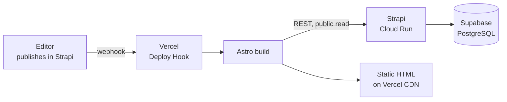
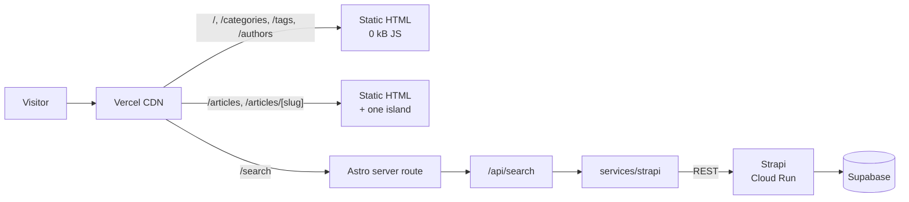
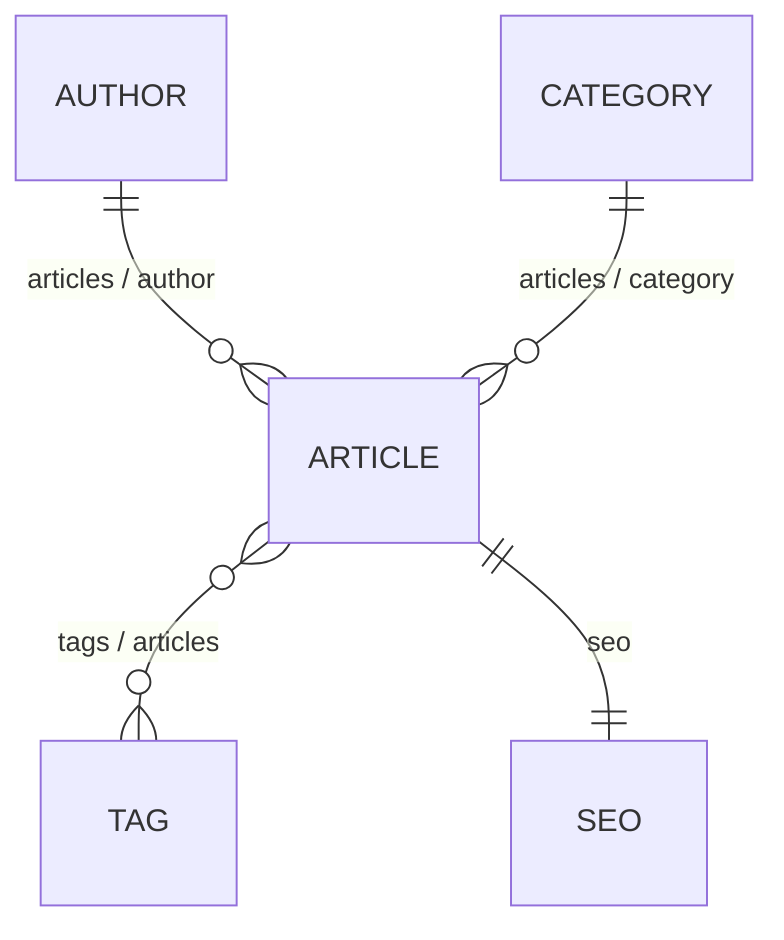

# Architecture — Phase 1

**English** · [Bahasa Indonesia](ARCHITECTURE.id.md)

Architecture proposal for the [Fullstack Headless CMS](../README.md). This is the Phase 1 deliverable: decisions and rationale only.

> [!IMPORTANT]
> **No application code has been written.** Phase 2 (initialization) starts only after this document is approved.

---

## Table of Contents

- [0. Decisions that need your approval](#0-decisions-that-need-your-approval)
- [1. Complete architecture](#1-complete-architecture)
- [2. Monorepo structure](#2-monorepo-structure)
- [3. Dependencies](#3-dependencies)
- [4. Content models](#4-content-models)
- [5. Content relationships](#5-content-relationships)
- [6. Astro vs island responsibilities](#6-astro-vs-island-responsibilities)
- [7. REST API integration strategy](#7-rest-api-integration-strategy)
- [8. PostgreSQL configuration](#8-postgresql-configuration)
- [9. Docker architecture](#9-docker-architecture)
- [10. GCP Cloud Run](#10-gcp-cloud-run)
- [11. Vercel deployment](#11-vercel-deployment)
- [Environment variables](#environment-variables)
- [Blockers before Phase 2](#blockers-before-phase-2)

---

## 0. Decisions that need your approval

Seven points where I had to choose, or where the root README does not yet cover the case. Three of them change `.env.example`.

| # | Decision | Proposal | Why it needs a call |
|---|---|---|---|
| D1 | **Rendering mode** | Prerender content pages at build; server-render only `/search` | Trades publish-to-live latency (~1–3 min rebuild) for near-zero hosting cost and best TTFB |
| D2 | **Media storage** | Cloudinary upload provider, not Strapi's local disk | **Cloud Run's filesystem is ephemeral — local uploads are destroyed on every restart.** Not optional if images must survive |
| D3 | **Strapi read access** | Public read permissions (`find`/`findOne` only), granted in `bootstrap()`; no API token | Simpler — no secret to manage — but leaves the content API readable by anyone who finds the URL. All writes stay closed |
| D4 | **Search data path** | Island → Astro `/api/search` → service layer → Strapi | Keeps the Strapi URL and token server-side; avoids opening CORS to the browser |
| D5 | **Docker base image** | `node:22-slim` (Debian), not Alpine | Strapi's `sharp` dependency is painful to build on Alpine; costs ~40 MB more image |
| D6 | **Cloud Run region** | `asia-southeast2` (Jakarta) | Lowest latency for an Indonesian audience; `asia-southeast1` (Singapore) is the alternative |
| D7 | **Node version** | Pin Node 22 LTS via `.nvmrc` | This machine runs Node 24, which is outside Strapi 5's supported matrix — see [Blockers](#blockers-before-phase-2) |
| D9 | **Production database** | Supabase Postgres for both development and production; no Cloud SQL | One managed database instead of two. Removes the Cloud SQL instance, the VPC connector and a data migration — the content already lives in Supabase. Cost: the database sits outside GCP, so it is one more provider in the stack |
| D8 | **Portfolio integration** | Served as `/blogs` on the existing Next.js portfolio via a rewrite; theme matched to it | Keeps this app standalone, so the islands and service layer still stand as portfolio work. The alternative — the portfolio fetching Strapi directly — would discard this entire frontend |

D2 is the one I would flag hardest: it is a correctness problem, not a preference. Everything else is a trade-off you could reasonably decide differently.

---

## 1. Complete architecture

Five layers, each with one owner:

| Layer | Owner | Responsibility |
|---|---|---|
| Authoring | Strapi Admin Panel | Editors create, edit, publish content |
| Persistence | PostgreSQL via Strapi's data layer | Stores content, relations, media metadata |
| Delivery | Strapi REST API | Serves published content over HTTPS |
| Presentation | Astro on Vercel | Renders HTML, owns routing and SEO |
| Interactivity | React / Vue / Svelte islands | Search and filtering only, one framework per page |

### Build time

Content pages are rendered once, when the site builds:



### Request time

Most visitors never touch Strapi at all:



The consequence worth noticing: because content pages are prerendered, **Cloud Run receives traffic only at build time and on search**. It can scale to zero, which is why this stays essentially free to host.

A second consequence only became obvious once Strapi actually went down mid-development: **a backend outage is invisible to visitors in production**. Content pages are static files, so they keep serving normally. An outage can only fail a build — which is the safe moment for it to fail — or degrade `/search`, which returns a friendly `503` rather than an error page. Verified against a real outage, not simulated.

### Trust boundary

The browser never holds a Strapi URL. It lives in Vercel's server-side environment, used by the Astro build and by `/api/search`.

Strapi's public role grants exactly `find` and `findOne` on the four content types and nothing else — every write action returns 403. Those grants live in `src/index.ts` (`bootstrap()`) rather than being clicked in the admin panel, because Strapi stores permissions in the **database**, not in files: a database that has never run this code would otherwise start with no permissions, and every request would fail with 403 in production only.

> [!NOTE]
> Public read is a deliberate trade-off. It is not a data leak — the same content appears on the public site — but it does leave the content API reachable by anyone who finds the URL, open to scraping, and able to wake Cloud Run with traffic. The upgrade path is a read-only API token: remove the `bootstrap()` grant and add `STRAPI_API_TOKEN` to the frontend environment.

This satisfies the root README's rule — Astro never touches PostgreSQL, and every read follows `Astro → REST → Strapi → PostgreSQL`.

---

## 2. Monorepo structure

```text
fullstack-headless-cms/
├── frontend/                          # Astro
│   ├── src/
│   │   ├── components/
│   │   │   ├── astro/                 # 14 components — 0 kB JS
│   │   │   ├── react/SearchBox.tsx    # /search island
│   │   │   ├── vue/ArticleFilter.vue  # /articles island
│   │   │   └── svelte/ReadingTools.svelte   # /articles/[slug] island
│   │   ├── layouts/BaseLayout.astro   # feed | article | plain
│   │   ├── pages/
│   │   │   ├── index.astro
│   │   │   ├── search.astro           # prerender = false
│   │   │   ├── 404.astro
│   │   │   ├── api/search.ts          # prerender = false
│   │   │   ├── articles/
│   │   │   │   ├── index.astro
│   │   │   │   ├── [slug].astro
│   │   │   │   └── page/[page].astro
│   │   │   ├── categories/[slug].astro
│   │   │   ├── tags/[slug].astro
│   │   │   └── authors/[slug].astro
│   │   ├── services/strapi/           # client, query, articles, authors, categories, tags
│   │   ├── types/strapi.ts
│   │   ├── utils/                     # date.ts, markdown.ts
│   │   ├── styles/global.css
│   │   └── config/site.ts
│   ├── .env.example
│   ├── .nvmrc
│   └── astro.config.mjs
│
├── backend/                           # Strapi
│   ├── src/
│   │   ├── api/                       # article, author, category, tag
│   │   │   └── <name>/{content-types,routes,controllers,services}
│   │   ├── components/shared/seo.json
│   │   └── index.ts                   # bootstrap(): grants public read
│   ├── config/                        # database, server, admin, api, middlewares, plugins
│   ├── scripts/seed.js                # sample content, supports --reset
│   ├── .env.example
│   ├── .nvmrc
│   └── Dockerfile
│
├── docs/ARCHITECTURE.md
├── README.md
└── .gitignore
```

Astro is not containerized. It runs on the host in development and on Vercel in production, so a container would add a moving part without buying anything.

---

## 3. Dependencies

Deliberately small. Every entry below is either required by the stack or named in the root README.

**Frontend**

| Package | Purpose |
|---|---|
| `astro` 7 | Framework |
| `@astrojs/vercel` | Deployment adapter, and the server runtime for `/search` |
| `@astrojs/react` + `react` + `react-dom` 19 | `/search` island |
| `@astrojs/vue` + `vue` 3 | `/articles` island |
| `@astrojs/svelte` + `svelte` 5 | `/articles/[slug]` island |
| `tailwindcss` 4 + `@tailwindcss/vite` | Styling — CSS-based config, no `tailwind.config.js` |
| `@fontsource-variable/geist` + `@fontsource-variable/geist-mono` | Self-hosted fonts, matched to the portfolio |
| `marked` | Renders article Markdown to HTML on the server |
| `typescript`, `@types/react`, `@types/react-dom` | Types |

No data-fetching library, no state manager, no UI kit — per the root README and the [earlier decision against TanStack Query](#7-rest-api-integration-strategy).

**Backend**

| Package | Purpose |
|---|---|
| `@strapi/strapi` 5.52 | CMS core |
| `@strapi/plugin-users-permissions` | Roles and permissions |
| `@strapi/provider-upload-cloudinary` | Media storage — see [D2](#0-decisions-that-need-your-approval) |
| `pg` | PostgreSQL driver |
| `@strapi/database` | Query engine used by Strapi core |
| `react`, `react-dom`, `react-router-dom`, `styled-components` | Strapi's own admin panel — not our choice, and never shipped to the public site |
| `@strapi/plugin-cloud` | Scaffolded by `create-strapi-app`, unused here — this project deploys to Cloud Run, not Strapi Cloud |

> [!NOTE]
> Exact package names and major versions are confirmed against the installed Astro, Tailwind and Strapi releases during Phase 2. Tailwind in particular changed how it integrates with Astro between v3 and v4, and the Strapi upload-provider package name depends on the Strapi major version.

---

## 4. Content models

Field types are Strapi's. Everything the root README lists is covered.

### Article

| Field | Type | Options |
|---|---|---|
| `title` | Text (short) | required |
| `slug` | UID | target `title`, required, unique |
| `excerpt` | Text (long) | max 300 |
| `content` | Rich text | required |
| `coverImage` | Media (single) | images only |
| `featured` | Boolean | default `false` |
| `author` | Relation | → Author |
| `category` | Relation | → Category |
| `tags` | Relation | → Tag |
| `seo` | Component | `shared.seo`, single |

> [!NOTE]
> `publishedAt` is **not** created by hand. Enabling Draft & Publish on Article makes Strapi manage that field itself. Adding it manually would collide with the built-in one.

### Author

| Field | Type | Options |
|---|---|---|
| `name` | Text (short) | required |
| `slug` | UID | target `name`, unique |
| `avatar` | Media (single) | images only |
| `bio` | Text (long) | — |

### Category

| Field | Type | Options |
|---|---|---|
| `name` | Text (short) | required |
| `slug` | UID | target `name`, unique |
| `description` | Text (long) | — |

### Tag

| Field | Type | Options |
|---|---|---|
| `name` | Text (short) | required |
| `slug` | UID | target `name`, unique |

### SEO component — `shared.seo`

| Field | Type | Options |
|---|---|---|
| `metaTitle` | Text (short) | max 60 |
| `metaDescription` | Text (long) | max 160 |
| `keywords` | Text (short) | comma-separated |
| `canonicalURL` | Text (short) | — |
| `socialImage` | Media (single) | images only |

The 60 and 160 caps are what search engines actually display; enforcing them in the admin panel stops editors from writing metadata that gets truncated.

---

## 5. Content relationships

| From | Type | To | Field names |
|---|---|---|---|
| Article | many-to-one | Author | `article.author` ↔ `author.articles` |
| Article | many-to-one | Category | `article.category` ↔ `category.articles` |
| Article | many-to-many | Tag | `article.tags` ↔ `tag.articles` |
| Article | component | `shared.seo` | `article.seo` |



Both sides are named, so `author.articles` powers the author page without a second query.

---

## 6. Astro vs island responsibilities

Astro owns every page, layout, and content component. A framework island appears only where something must change on screen without navigating.

| Page | Island | Framework | JS shipped (gzip) |
|---|---|---|---|
| `/search` | Search box + live results | React | 60.4 kB |
| `/articles` | Category & tag filter | Vue | 29.3 kB |
| `/articles/[slug]` | Table of contents, reading progress, copy-code | Svelte | 16.1 kB |
| `/` | — | — | **0 kB** |
| `/categories/[slug]` | — | — | **0 kB** |
| `/tags/[slug]` | — | — | **0 kB** |
| `/authors/[slug]` | — | — | **0 kB** |
| `/404` | — | — | **0 kB** |

Those figures are measured from the build output, not estimated. They are also the reason each framework sits where it does: the article page is the one visitors actually read, so it gets the lightest runtime available. React on that page would cost roughly four times as much.

> [!CAUTION]
> Nothing in the shared header or footer may be a framework island. A mobile-nav toggle built in React would land on all seven pages and collide with Vue and Svelte. Shared-layout interactivity is an `.astro` component with plain JavaScript.

Pagination stays server-rendered `<a href="/articles/2">` — crawlable, works without JavaScript, and needs no island.

Full reasoning is in [`frontend/README.md`](../frontend/README.md).

---

## 7. REST API integration strategy

```text
src/services/strapi/
├── client.ts        # the only fetch() in the codebase
├── query.ts         # builds populate / filter / sort / pagination params
├── articles.ts
├── authors.ts
├── categories.ts
└── tags.ts
```

`client.ts` owns five things so nothing else has to: base URL and token from env, query-string building, a request timeout via `AbortSignal`, mapping any non-2xx into a typed error, and normalising the response envelope.

**Functions** — exactly the list the root README asks for:

| Function | Used by |
|---|---|
| `getFeaturedArticles(limit)` | `/` |
| `getLatestArticles(limit)` | `/` |
| `getArticles({ page, pageSize })` | `/articles` |
| `getArticleBySlug(slug)` | `/articles/[slug]` |
| `getArticlesByCategory(slug, page)` | `/categories/[slug]` |
| `getArticlesByTag(slug, page)` | `/tags/[slug]` |
| `getRelatedArticles(article, limit)` | `/articles/[slug]` |
| `getAuthorBySlug(slug)` | `/authors/[slug]` |
| `searchArticles(q, page)` | `/api/search` |

**Populate is always explicit.** `populate=*` pulls every relation and every media format on every request; a listing page needs `coverImage`, `author.name` and `category.slug` and nothing else. Each function declares its own populate set.

**Search path** — the island never calls Strapi:

```text
React island  ──fetch──▶  /api/search?q=…   (Astro server route, same origin)
                              │
                              ▼
                        searchArticles()    (the same service layer the pages use)
                              │
                              ▼
                        Strapi REST  ──▶  PostgreSQL
```

That keeps `STRAPI_API_URL` on the server, needs no CORS entry for the browser, and means pages and islands share one source of truth. Per the [earlier decision](../README.md#islands), the island uses `useState` + `useEffect` + `AbortController` with a debounce — no TanStack Query, no SWR.

> [!NOTE]
> Strapi changed its REST response shape between v4 and v5 (v5 flattens away the `attributes` nesting). The TypeScript types in `src/types/` are written against whichever major we install, and that is confirmed in Phase 3.

---

## 8. PostgreSQL configuration

**One managed database serves both environments: Supabase Postgres.** Development connects to it from the laptop; production connects to it from Cloud Run. See [D9](#0-decisions-that-need-your-approval).

Connections go through Supabase's **session pooler**, not the direct connection and not the transaction pooler:

```bash
DATABASE_HOST=aws-0-<region>.pooler.supabase.com
DATABASE_PORT=5432          # session mode
DATABASE_SSL=true
DATABASE_SSL_REJECT_UNAUTHORIZED=false
DATABASE_POOL_MIN=0
DATABASE_POOL_MAX=5
```

Session mode matters. Strapi uses Knex with a long-lived connection pool; the transaction pooler on port 6543 recycles connections after each transaction and breaks prepared statements, producing errors that point nowhere near the cause. The direct connection is IPv6-only on new projects.

`DATABASE_POOL_MIN=0` keeps Strapi from opening connections eagerly at boot, so a single refused connection cannot fail the whole startup.

`config/database.ts` reads every value from `DATABASE_*` env vars, so the same image runs locally and in production with nothing but a different environment.

**Schema changes.** Content-Type Builder writes JSON schema files under `src/api/`. Those are committed to git and applied by Strapi on boot. So the flow is: change the model in local development → commit the schema → deploy → production migrates itself. Content-Type Builder is disabled in production, which is Strapi's default and should stay that way.

No raw SQL anywhere. All reads, writes, filtering, sorting and pagination go through Strapi's data layer, per the root README.

---

## 9. Docker architecture

Only Strapi is containerized. Two stages:

| Stage | Base | Does |
|---|---|---|
| `builder` | `node:22-slim` | Installs all dependencies, copies source, runs `strapi build` to compile the admin panel |
| `runner` | `node:22-slim` | Installs production dependencies only, copies the built admin panel and source, drops to a non-root user, runs `strapi start` |

Multi-stage earns its place here: building the admin panel needs the full dev toolchain and produces a large intermediate tree, none of which the running container needs. The final image carries runtime dependencies and build output only.

**Base image** — Debian slim rather than Alpine. Strapi depends on `sharp` for image processing, which ships prebuilt binaries for glibc; on Alpine's musl it usually has to compile from source, which means dragging in a build toolchain and a fragile build. The ~40 MB Debian costs is worth not fighting that.

`strapi build` was measured to need **no environment variables at all** — it compiles TypeScript and bundles the admin panel without reading `.env`. So the builder stage carries no dummy secrets and no build arguments; every secret arrives at run time only.

`.dockerignore` excludes `node_modules`, `dist`, `build`, `.cache`, `.tmp`, `.strapi`, `.git`, `scripts`, and docs.

> [!IMPORTANT]
> Two entries matter more than the rest.
>
> `.env` **must** be excluded. Without it, secrets are baked into an image layer and stay extractable even if a later layer deletes the file.
>
> `types/` must **not** be excluded, even though it looks like generated output. `tsconfig.json` includes `./**/*.ts`, so `types/generated/*.d.ts` is inside the compilation scope; dropping it from the build context would leave `tsc` without those types.

**The final image never contains a secret.** Everything sensitive is injected as an environment variable at run time, from Secret Manager.

`docker-compose.yml` at the repo root builds and runs that same image locally against the same Supabase database. It has **no Postgres service**: the project uses one managed database for both environments ([D9](#0-decisions-that-need-your-approval)), so a local Postgres would only be a third database whose contents match neither.

---

## 10. GCP Cloud Run

| Component | Configuration |
|---|---|
| Artifact Registry | Docker repository holding the Strapi image |
| Cloud Run | Service `strapi-cms`, region `asia-southeast2`, port 1337, min instances **0**, max 2 |
| Secret Manager | `APP_KEYS`, `API_TOKEN_SALT`, `ADMIN_JWT_SECRET`, `TRANSFER_TOKEN_SALT`, `JWT_SECRET`, `ENCRYPTION_KEY`, `DATABASE_PASSWORD`, `CLOUDINARY_SECRET` |
| Service account | `roles/secretmanager.secretAccessor`, nothing more |

The database lives outside GCP ([D9](#0-decisions-that-need-your-approval)), and media lives on Cloudinary ([D2](#0-decisions-that-need-your-approval)). What remains inside GCP is a single stateless container plus its secrets — no Cloud SQL instance, no VPC connector, no database service account.

The image is built by Cloud Build from the `Dockerfile`, so no Docker daemon is needed on a developer machine:

```bash
gcloud run deploy strapi-cms --source backend --region asia-southeast2
```

**Min instances 0** is affordable precisely because of [D1](#0-decisions-that-need-your-approval): content pages are prerendered, so Strapi is idle between builds. The cost is a cold start of a few seconds on the first search after a quiet period — acceptable for a portfolio, and worth stating rather than hiding.

> [!WARNING]
> **Cloud Run's filesystem is ephemeral.** Strapi's default upload provider writes to `public/uploads` on local disk, and that disk is discarded whenever the container restarts, redeploys, or scales. Every uploaded image would silently disappear.
>
> The fix is Cloudinary: it stores and serves the media, and Strapi keeps only the URL. This is [D2](#0-decisions-that-need-your-approval), and it must be settled before Phase 3 — content created without it will lose its images.
>
> Cloudinary is Strapi's **officially maintained** provider, so it tracks Strapi releases rather than lagging behind them, and it brings a CDN and on-the-fly image transforms with it — `f_auto` and `q_auto` alone remove most of the image-optimisation work a content site would otherwise have to do by hand. It also keeps media entirely outside GCP, which leaves this project's GCP footprint at Cloud Run, Artifact Registry and Secret Manager, and nothing else. Its free tier is comfortably enough for a portfolio project.

> [!NOTE]
> Strapi's security middleware ships a Content Security Policy that only permits images from its own origin. With Cloudinary, `res.cloudinary.com` has to be added to `img-src` and `media-src` in `config/middlewares.ts` — otherwise the admin panel shows broken thumbnails while the API returns perfectly valid URLs, which reads like an upload bug and is not one.

---

## 11. Vercel deployment

| Setting | Value |
|---|---|
| Root directory | `frontend/` |
| Framework preset | Astro |
| Adapter | `@astrojs/vercel` |
| Environment | `STRAPI_API_URL`, `PUBLIC_SITE_URL` |

`STRAPI_API_URL` has no `PUBLIC_` prefix, so Astro keeps it server-side; only `PUBLIC_SITE_URL` reaches the browser, and it is not a secret — canonical URLs and Open Graph tags need it.

**Publish → live.** A Strapi webhook on entry publish and unpublish calls a Vercel Deploy Hook, which rebuilds and redeploys the static pages. Editors see changes after a build, not instantly. That is the trade-off in [D1](#0-decisions-that-need-your-approval), and the alternative — full server rendering — costs a Cloud Run round trip on every page view instead.

Pull requests get preview deployments automatically, pointed at the same Strapi instance.

### Serving under the portfolio's `/blogs`

This site is not a standalone destination. It becomes the blog section of an existing Next.js portfolio (Tailwind 4, deployed on Vercel), reached at `situs.com/blogs/*` through a rewrite:

```js
// next.config.js in the portfolio
async rewrites() {
  return [{ source: '/blogs/:path*', destination: 'https://<this-app>.vercel.app/:path*' }];
}
```

Two changes follow from that, both due at Phase 8: `base: '/blogs'` in `astro.config.mjs` so internal links resolve under the prefix, and the portfolio's navbar entry pointing at `/blogs` instead of its old blog page.

The portfolio's existing blog page turned out to be a stub — hardcoded sample data that the component discards, no API route, no table in its MySQL database — so nothing needs migrating. That page and its components can simply be deleted.

The theme is matched to the portfolio, which is why this site is **dark-only** and carries no `dark:` variants: `#030712` background, `#f9fafb` foreground, Geist Sans and Geist Mono. See [`frontend/README.md`](../frontend/README.md).

---

## Environment variables

**`frontend/.env.example`**

```bash
STRAPI_API_URL=
PUBLIC_SITE_URL=
```

**`backend/.env.example`**

```bash
HOST=
PORT=

APP_KEYS=
API_TOKEN_SALT=
ADMIN_JWT_SECRET=
TRANSFER_TOKEN_SALT=
JWT_SECRET=
ENCRYPTION_KEY=          # required by Strapi 5.52+

DATABASE_CLIENT=postgres
DATABASE_HOST=
DATABASE_PORT=
DATABASE_NAME=
DATABASE_USERNAME=
DATABASE_PASSWORD=
DATABASE_SSL=
DATABASE_SSL_REJECT_UNAUTHORIZED=

CLOUDINARY_NAME=           # NEW — media storage, see D2
CLOUDINARY_KEY=            # NEW
CLOUDINARY_SECRET=         # NEW
```

Additions to what the root README specifies, all consequences of decisions above. `STRAPI_API_TOKEN` was dropped when D3 settled on public read instead of a token.

---

## Blockers before Phase 2

Three things on this machine need resolving first. None are hard, but all three stop Phase 2 or Phase 7 cold.

| # | Blocker | Detail | Fix |
|---|---|---|---|
| B1 | **Node 24.13.0 installed** | Strapi 5's supported matrix is Node 20 and 22 LTS. Node 24 is outside it and commonly breaks install or build | Install Node 22 LTS via `nvm`, add `.nvmrc` to both workspaces |
| B2 | **Docker not installed** | Needed for local PostgreSQL now, and for Phase 7 | Install Docker Desktop |
| B3 | **Branch is `master`, zero commits** | Convention and GitHub default is `main`; trivial now, annoying later | `git branch -m master main` before the first commit |

B1 is the only one that blocks Phase 2 immediately. B2 can wait until PostgreSQL is actually needed, and B3 takes seconds.

---

## What Phase 2 will do, once approved

Initialize the monorepo, scaffold Astro with the three framework integrations and Tailwind, scaffold Strapi with the PostgreSQL connector, wire both `.env.example` files, and confirm both apps boot. No content models, no pages, no islands — those are Phases 3 through 5.
