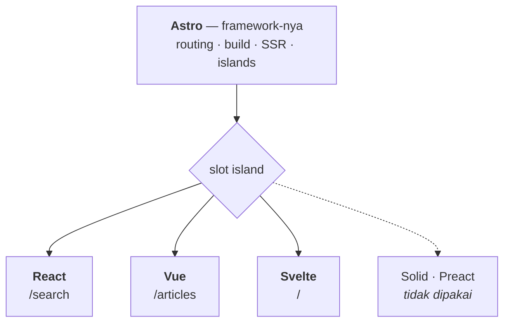

# Frontend — Astro

[](https://astro.build)
[](https://react.dev)
[](https://vuejs.org)
[](https://svelte.dev)
[](https://www.typescriptlang.org)
[](https://tailwindcss.com)
[](https://vercel.com)

[English](README.md) · **Bahasa Indonesia**

Frontend Astro untuk [Fullstack Headless CMS](../README.id.md) — situs publik yang mengonsumsi konten terbit dari Strapi melalui REST API.

> [!NOTE]
> Konteks lintas-modul — tujuan, arsitektur sistem, tech stack, environment variable, kualitas kode, dan fase implementasi — ada di [README root](../README.id.md).

---

## Daftar Isi

- [Arsitektur: Astro vs UI Framework](#arsitektur-astro-vs-ui-framework)
- [Routing](#routing)
- [Tema](#tema)
- [Jebakan saat pengembangan](#jebakan-saat-pengembangan)
- [Fitur Utama](#fitur-utama)
- [SEO](#seo)
- [Penanganan Error](#penanganan-error)

---

## Arsitektur: Astro vs UI Framework

Frontend ini adalah aplikasi **Astro** — bukan React SPA, bukan Next.js. React, Vue, dan Svelte hanyalah integrasi yang dimuat Astro untuk segelintir komponen yang memang butuh interaktivitas di browser.

Jadi `components/astro/` dan folder framework di sebelahnya bukan pilihan setara, melainkan **default dan pengecualian**.

### Siapa memegang apa

`.astro` itu **bukan** React. Astro punya bahasa komponennya sendiri; UI framework baru masuk saat kamu membuat file `.tsx`, `.vue`, atau `.svelte`.

Astro memegang lapisan framework — routing berbasis file dari `src/pages/`, proses build (Vite di dalamnya), server rendering, dan mekanisme island itu sendiri. React, Vue, dan Svelte tidak memegang apa pun kecuali komponen interaktif yang secara eksplisit kamu serahkan pada mereka.



Slot itulah yang membedakan Astro dari meta-framework lain:

| Meta-framework | Terikat ke |
|---|---|
| Next.js | React saja |
| Nuxt | Vue saja |
| SvelteKit | Svelte saja |
| **Astro** | bebas — bahkan beberapa sekaligus |

Jadi hanya Astro yang benar-benar menopang arsitektur:

| Teknologi | Perannya | Bisa diganti? |
|---|---|---|
| **Astro** | Framework — routing, build, SSR, islands | Tidak — dia *adalah* arsitekturnya |
| **React / Vue / Svelte** | Library UI untuk island interaktif | Bisa — mana pun, atau tidak sama sekali |
| **TypeScript** | Bahasa, di `.astro` maupun komponen framework | — |
| **Tailwind** | Styling | Bisa |

### Satu framework per halaman

Tiga framework ini pilihan yang disengaja: keduanya mendemonstrasikan bahwa island Astro bersifat framework-agnostic. Demonstrasi itu baru layak dilakukan kalau tidak membebani pengunjung sama sekali.

> [!WARNING]
> Tiap framework mengirim runtime-nya **sendiri**, dan tidak ada yang dipakai bersama. Dua framework dalam satu halaman berarti pengunjung mengunduh keduanya. Island dari framework berbeda tidak boleh muncul di halaman yang sama.

| Halaman | Island | Framework | JS terkirim (gzip) |
|---|---|---|---|
| `/search` | `SearchBox.tsx` — kotak cari + hasil langsung | React | 60,4 kB |
| `/articles` | `ArticleFilter.vue` — filter kategori & tag | Vue | 29,3 kB |
| `/articles/[slug]` | `ReadingTools.svelte` — daftar isi, progres baca, salin kode | Svelte | 16,1 kB |
| `/` | — | — | **0 kB** |
| `/categories/[slug]` | — | — | **0 kB** |
| `/tags/[slug]` | — | — | **0 kB** |
| `/authors/[slug]` | — | — | **0 kB** |
| `/404` | — | — | **0 kB** |

Angka-angka itu diukur dari hasil build, bukan diperkirakan. Itu juga alasan tiap framework ditempatkan di situ: halaman artikel adalah yang benar-benar dibaca pengunjung, jadi dia mendapat runtime paling ringan yang tersedia. React di halaman yang sama akan berbiaya sekitar empat kali lipat.

> [!CAUTION]
> Waspadai **island global**. Apa pun yang ada di layout bersama — rail navigasi mengambang atau footer — akan muncul di semua halaman dan bertabrakan dengan ketiga framework sekaligus. Bangun interaktivitas di layout bersama sebagai komponen `.astro` dengan JavaScript biasa.

### Perbedaannya

| | `components/astro/*.astro` | komponen framework |
|---|---|---|
| Dirender | Hanya di server | Di server, lalu dihidupkan lagi di browser |
| JavaScript terkirim | **0 kB** | Runtime framework + kode komponen |
| State lokal / event handler | Tidak tersedia | Tersedia |
| Dipakai untuk | Menampilkan konten | Merespons aksi pengguna |

Komponen `.astro` adalah cetakan HTML. Dia jalan sekali di server, menghasilkan HTML jadi, dan kodenya sendiri tidak pernah sampai ke browser — persis itulah sebabnya dia tidak bisa punya state atau event handler.

### Komponen mana ditaruh di mana

```text
components/
├── astro/                    # mayoritas ada di sini
│   ├── BaseHead.astro        # meta tag SEO
│   ├── SideRail.astro        # nav ikon mengambang, disamakan dengan portofolio
│   ├── ArticleCard.astro     # judul, gambar, excerpt, link
│   ├── AuthorBox.astro
│   ├── TagList.astro         # link biasa
│   ├── Pagination.astro      # <a href="/articles/2">, bukan tombol
│   └── EmptyState.astro
│
├── react/
│   └── SearchBox.tsx         # /search — user mengetik, hasil berubah langsung
│
├── vue/
│   └── ArticleFilter.vue     # /articles — pilih kategori, daftar menyempit
│
└── svelte/
    └── TopicExplorer.svelte  # / — menjelajah topik populer
```

Perhatikan `Pagination.astro`. Pagination cukup `<a href="/articles/2">` — link asli bisa di-crawl dan bisa dibuka di tab baru, jadi memakai framework justru memperburuk, bukan memperbaiki.

`SearchBox.tsx` adalah kasus sebaliknya: hasil harus berubah saat pengguna mengetik, tanpa reload halaman. Itu mustahil tanpa JavaScript di browser, jadi framework di sini memang beralasan.

### Cara keduanya bertemu

```astro
---
// src/pages/search.astro — frontmatter ini jalan di SERVER
import Layout from '../layouts/BaseLayout.astro';
import ArticleCard from '../components/astro/ArticleCard.astro';
import SearchBox from '../components/react/SearchBox.tsx';
import { getArticles } from '../services/strapi/articles';

const articles = await getArticles();   // hit Strapi dari server, bukan dari browser
---

<Layout title="Pencarian">
  <SearchBox client:visible />

  {articles.map((a) => <ArticleCard article={a} />)}
</Layout>
```

### Hydration, bukan client rendering

Komponen framework di sini **tidak** dirender dari nol di browser:

1. Astro merender komponen itu menjadi HTML jadi **di server**
2. HTML tersebut sampai ke browser dalam keadaan lengkap dan terlihat
3. Baru jika ada directive `client:*`, JavaScript-nya menyusul dan menghidupkannya

Jadi `<SearchBox client:visible />` sudah ada di HTML source sebelum JavaScript apa pun termuat — crawler dan pengguna langsung melihatnya. SPA yang benar-benar client-rendered justru mengirim `<div id="root"></div>` kosong, dan itulah yang merusak SEO.

> [!IMPORTANT]
> Komponen framework **tanpa** directive `client:*` tetap dirender jadi HTML statis dan **tidak** mengirim JavaScript sama sekali. Yang mengirim JavaScript adalah directive-nya, bukan ekstensi filenya.
>
> ```astro
> <SearchBox />                 <!-- HTML mati, 0 kB JS -->
> <SearchBox client:visible />  <!-- interaktif, JS dimuat saat masuk viewport -->
> ```

Tiap island adalah root yang berdiri sendiri dengan lifecycle-nya masing-masing. Hidrasinya terpisah dan secara default tidak berbagi state — dan antar framework berbeda, sama sekali tidak bisa berbagi state.

Untuk memilih antara `client:load`, `client:idle`, dan `client:visible`, lihat [Islands](../README.id.md#islands) di README root.

### Aturannya

Sebelum membuat komponen, tanyakan satu hal:

> Apakah ada yang harus berubah di layar tanpa berpindah halaman?

**Tidak → `.astro`. Ya → komponen framework, memakai framework yang sudah dipegang halaman itu.**

Perkiraannya sekitar selusin komponen Astro berbanding tiga komponen framework. Beranda, halaman kategori, tag, author, dan 404 mengirim **0 kB JavaScript**; halaman artikel mengirim 16,1 kB karena membawa perkakas baca.

## Routing

| File | URL | Rendering |
|---|---|---|
| `pages/index.astro` | `/` | prerender |
| `pages/articles/index.astro` | `/articles` | prerender — seluruh arsip, disaring di klien |
| `pages/articles/page/[page].astro` | `/articles/page/2`, … | prerender — kelebihan di atas 100 artikel |
| `pages/articles/[slug].astro` | `/articles/<slug>` | prerender, satu per artikel |
| `pages/categories/[slug].astro` | `/categories/<slug>` | prerender, satu per kategori |
| `pages/tags/[slug].astro` | `/tags/<slug>` | prerender, satu per tag |
| `pages/authors/[slug].astro` | `/authors/<slug>` | prerender, satu per author |
| `pages/404.astro` | `/404` | prerender |
| `pages/search.astro` | `/search` | **saat request** — `prerender = false` |
| `pages/api/search.ts` | `/api/search?q=` | **saat request** — JSON, proxy ke Strapi |

Selain `/search` dan `/api/search`, semuanya dihasilkan dari Strapi saat build — jadi jumlah halaman mengikuti isi konten. Hanya kedua route itu yang butuh Strapi hidup saat request; keduanya bergantung pada `?q=` yang mustahil diketahui saat build.

> [!WARNING]
> **Pagination sengaja ditaruh di `/articles/page/`, bukan `/articles/[...page]`.**
>
> Rest route (`[...page].astro`) yang berada satu direktori dengan `[slug].astro` akan mengklaim seluruh wilayah `/articles/*`, termasuk slug artikel. Build statis menyembunyikan masalah ini — kedua path digenerate eksplisit dan tidak pernah berebut — tapi dev server mencocokkan route secara dinamis, dan di sana rest route yang menang. Gejalanya: setiap halaman detail artikel 404 di `npm run dev`, padahal `npm run build` menghasilkan halaman-halaman itu tanpa keluhan.
>
> Memisahkan keduanya ke direktori berbeda menghapus ambiguitasnya sama sekali.

---

## Tema

Situs ini adalah bagian blog dari portofolio Next.js yang sudah ada, jadi temanya disamakan dengan portofolio, bukan dirancang sendiri.

| Token | Nilai |
|---|---|
| Latar | `#030712` (gray-950) |
| Teks | `#f9fafb` (gray-50) |
| Font | Geist Variable / Geist Mono Variable, self-hosted |
| Kartu | `bg-gray-900`, `border-gray-700`, `rounded-lg` |
| Area konten | gradien `from-gray-900 to-gray-800` |

> [!IMPORTANT]
> Situs ini **dark-only**. Tidak ada varian `dark:` di mana pun, dan menambahkannya justru merusak keselarasan — portofolio tidak punya mode terang untuk disamakan.

Font di-*self-host* lewat `@fontsource-variable/geist`, bukan diambil dari Google Fonts, supaya tidak ada permintaan pihak ketiga yang memblokir render sebelum tampilan pertama muncul.

Tipografi artikel (`.prose-knowly` di `src/styles/global.css`) ditulis tangan alih-alih memakai `@tailwindcss/typography`. Yang butuh gaya hanya heading, list, blockquote, kode, dan gambar — tidak sepadan dengan satu dependensi lagi, mengikuti aturan minimal dependencies proyek ini.

---

## Jebakan saat pengembangan

Dua kegagalan di proyek ini sempat menghabiskan waktu debug. Keduanya terlihat seperti bug kode, padahal bukan.

### File route butuh dev server direstart

Menambah atau menghapus file di `src/pages/` saat `npm run dev` berjalan bisa menyisakan tabel route yang basi. Gejalanya `404` pada halaman yang justru dihasilkan `npm run build` tanpa keluhan.

```bash
pkill -f 'astro dev'
lsof -nP -iTCP:4321 -sTCP:LISTEN   # harus kosong
npm run dev
```

Baris `lsof` itu penting: menutup terminal tidak selalu mematikan prosesnya, dan proses yang selamat akan terus menyajikan route lama.

### Framework UI baru butuh cache Vite dibersihkan

Setelah memasang integrasi (React, Vue, Svelte) ke proyek yang sudah pernah dijalankan di mode dev, cache pre-bundle dependensi Vite bisa basi. Island-nya lalu ter-render dari server, dihidrasi, lalu hilang — karena framework-nya termuat dua kali saat runtime dan hook-nya rusak.

```bash
pkill -f 'astro dev'
rm -rf node_modules/.vite
npm run dev
```

Cirinya: HTML dari server memuat komponennya, tapi browser menampilkan kosong beberapa saat kemudian. Kalau membersihkan cache tidak menolong, console browser akan menyebut error sebenarnya — `Invalid hook call`, ketidakcocokan hidrasi, atau sesuatu yang dilempar di dalam komponennya.

---

### Navigasi

Navigasi situs berupa **rail ikon mengambang** di sisi kiri, bukan header atas — disalin dari `components/navbar` milik portofolio supaya keduanya terasa satu situs begitu Knowly disajikan di `/blogs`.

`SideRail.astro` meniru geometri aslinya: `fixed left-2 top-1/2 -translate-y-1/2`, pil `rounded-full` dengan `bg-gray-900/90` dan `backdrop-blur-xl`, target 9×9 (11×11 mulai `sm`), item aktif dibalik jadi `bg-white text-gray-950`, dan tooltip yang menggeser keluar saat hover.

Ikonnya SVG inline bergaya lucide (stroke 1.8, 18 px), bukan paket `lucide`. Tiga ikon tidak sepadan dengan satu dependensi, dan komponen ini harus tetap **0 kB JavaScript**.

> [!NOTE]
> Rail-nya untuk sekarang memuat route milik Knowly sendiri. Begitu situs ini disajikan di `/blogs` milik portofolio ([D8](../docs/ARCHITECTURE.id.md)), isinya sebaiknya diganti dengan navigasi global portofolio — kalau tidak, pengunjung yang mendarat di blog kehilangan jalan kembali ke Projects dan About.

## Fitur Utama

### Website Publik

<table>
<tr><td valign="top">

**Homepage**

- Hero section
- Featured articles
- Latest articles
- Kategori
- Topik populer

</td><td valign="top">

**Daftar Artikel**

- Article card
- Pagination
- Filter kategori
- Filter tag
- Search

</td><td valign="top">

**Detail Artikel**

- Judul
- Cover image
- Author
- Tanggal publikasi
- Kategori
- Tag
- Isi artikel
- Artikel terkait
- Metadata SEO

</td></tr>
<tr><td valign="top">

**Halaman Kategori**

- Informasi kategori
- Artikel yang termasuk dalam kategori tersebut

</td><td valign="top">

**Halaman Tag**

- Artikel yang terkait dengan tag tersebut

</td><td valign="top">

**Halaman Author**

- Informasi author
- Artikel milik author tersebut

</td></tr>
<tr><td valign="top" colspan="3">

**Search**

- Pencarian artikel
- Empty state
- Error state

</td></tr>
</table>

---

## SEO

Buat penanganan SEO Astro yang reusable.

**Dukung**

- Page title
- Meta description
- Canonical URL
- Open Graph title
- Open Graph description
- Open Graph image
- Metadata artikel

Hasilkan metadata dari komponen SEO milik Strapi.

Setiap halaman artikel harus memiliki metadata yang unik.

---

## Penanganan Error

Setiap kasus di bawah diuji terhadap pemadaman Strapi yang benar-benar terjadi, bukan simulasi.

### Saat Strapi tidak tersedia

| Jalur | Perilaku | Alasan |
|---|---|---|
| Build | **Gagal keras** dengan pesan `StrapiError` bertipe | Build yang setengah berhasil akan menerbitkan halaman artikel tanpa isi artikelnya |
| `/` dan `/articles` (dev) | `200` dengan pemberitahuan ramah | Keduanya membungkus fetch-nya dan menampilkan `ErrorState` |
| `/api/search` | `503`, *"Pencarian sedang tidak tersedia."* | Tidak ada kode status, hostname, atau stack trace yang sampai ke browser |
| `/articles/[slug]` dan halaman arsip (dev) | `500` | Disengaja — lihat di bawah |
| **Semua halaman konten di produksi** | **Tidak terpengaruh** | Semuanya file statis; hanya `/search` yang butuh Strapi hidup saat request |

Baris terakhir itu layak diberi nama: karena halaman konten di-prerender, pemadaman Strapi tidak terlihat oleh pengunjung di produksi. Dia hanya bisa menggagalkan build atau halaman pencarian.

### Kenapa halaman prerender tidak diberi try/catch

`/articles/[slug]`, `/categories/[slug]`, `/tags/[slug]`, dan `/authors/[slug]` sengaja membiarkan error merambat naik.

Membungkusnya akan membuat build **sukses** lalu menerbitkan halaman artikel kosong. Build yang gagal masih bisa diperbaiki; situs yang tampak baik-baik saja padahal kosong tidak. `500` yang muncul di mode dev adalah sinyal untuk developer, dan memang harus keras.

### Validasi input di `/api/search`

| Kata kunci | Respons |
|---|---|
| kosong atau 1 huruf | `200` dengan `tooShort: true` — database tidak disentuh |
| 2–80 karakter | `200` dengan hasil |
| lebih dari 80 karakter | `400` — kata kunci raksasa hanya membebani database tanpa hasil berarti |

### Gambar tidak tersedia

Gambar sampul, thumbnail feed, dan avatar penulis dibekali `onerror` inline yang menghapus elemen rusaknya. Wadah thumbnail tetap berlatar gradien, jadi gambar yang gagal menyisakan bidang rapi, bukan lubang.

Itu atribut HTML biasa, bukan island — biayanya **0 kB**.

### Komponen

| Komponen | Menangani |
|---|---|
| `ErrorState.astro` | Strapi tidak terjangkau — kalimat ramah, tanpa detail teknis |
| `EmptyState.astro` | Tidak ada artikel di kategori, tag, author, atau hasil filter |
| `404.astro` | Route atau slug tidak dikenal |
| `client.ts` | Timeout 10 detik, `StrapiError` bertipe, pesan yang dinormalisasi |

> [!CAUTION]
> Detail error internal tidak pernah sampai ke pengunjung. `client.ts` mengubah setiap kegagalan jadi `StrapiError` dengan pesan aman, dan halaman menampilkan kalimat tetap, bukan teks yang dilempar.
