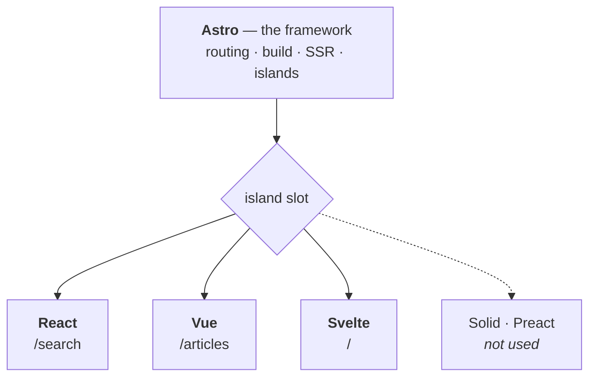

# Frontend — Astro

[](https://astro.build)
[](https://react.dev)
[](https://vuejs.org)
[](https://svelte.dev)
[](https://www.typescriptlang.org)
[](https://tailwindcss.com)
[](https://vercel.com)

**English** · [Bahasa Indonesia](README.id.md)

Astro frontend for the [Fullstack Headless CMS](../README.md) — the public website that consumes published content from Strapi through the REST API.

> [!NOTE]
> Project-wide context — goal, system architecture, tech stack, environment variables, code quality, and the implementation phases — lives in the [root README](../README.md).

---

## Table of Contents

- [Architecture: Astro vs UI Frameworks](#architecture-astro-vs-ui-frameworks)
- [Core Features](#core-features)
- [SEO](#seo)
- [Error Handling](#error-handling)

---

## Architecture: Astro vs UI Frameworks

This frontend is an **Astro** application — not a React SPA and not Next.js. React, Vue and Svelte are integrations that Astro loads for the handful of components which genuinely need browser interactivity.

So `components/astro/` and the framework folders beside it are not equal choices. They are **default and exception**.

### Who owns what

`.astro` is **not** React. Astro has its own component language; a UI framework only enters the picture when you create a `.tsx`, `.vue` or `.svelte` file.

Astro owns the framework layer — file-based routing from `src/pages/`, the build (Vite underneath), server rendering, and the islands mechanism itself. React, Vue and Svelte own nothing except the interactive components you explicitly hand them.



That slot is what separates Astro from every other meta-framework:

| Meta-framework | Locked to |
|---|---|
| Next.js | React only |
| Nuxt | Vue only |
| SvelteKit | Svelte only |
| **Astro** | any of them — and several at once |

So only Astro is load-bearing here:

| Technology | Role | Replaceable? |
|---|---|---|
| **Astro** | Framework — routing, build, SSR, islands | No — it *is* the architecture |
| **React / Vue / Svelte** | UI libraries for interactive islands | Yes — any of them, or none |
| **TypeScript** | Language, across `.astro` and framework components | — |
| **Tailwind** | Styling | Yes |

### One framework per page

Three frameworks are a deliberate choice: they demonstrate that Astro's islands are framework-agnostic. That demonstration is only worth making if it costs the visitor nothing.

> [!WARNING]
> Each framework ships its **own** runtime, and none of it is shared. Two frameworks on one page means the visitor downloads both. Islands of different frameworks must never appear on the same page.

| Page | Island | Framework | JS shipped |
|---|---|---|---|
| `/` | Popular topics explorer | Svelte | Svelte only |
| `/articles` | Category & tag filter | Vue | Vue only |
| `/search` | Search box + live results | React | React only |
| `/articles/[slug]` | — | — | **0 kB** |
| `/categories/[slug]` | — | — | **0 kB** |
| `/tags/[slug]` | — | — | **0 kB** |
| `/authors/[slug]` | — | — | **0 kB** |

> [!CAUTION]
> Watch for **global islands**. Anything in the shared header or footer — a mobile navigation toggle, for instance — appears on every page and would collide with all three frameworks at once. Build shared-layout interactivity as an `.astro` component with plain JavaScript instead.

### The difference

| | `components/astro/*.astro` | framework components |
|---|---|---|
| Rendered | On the server only | On the server, then revived in the browser |
| JavaScript shipped | **0 kB** | Framework runtime + component code |
| Local state / event handlers | Not available | Available |
| Use for | Displaying content | Responding to user input |

An `.astro` component is an HTML template. It runs once on the server, emits finished HTML, and its own code never reaches the browser — which is precisely why it cannot hold state or event handlers.

### Where each component belongs

```text
components/
├── astro/                    # the majority live here
│   ├── BaseHead.astro        # SEO meta tags
│   ├── Header.astro
│   ├── ArticleCard.astro     # title, image, excerpt, link
│   ├── AuthorBox.astro
│   ├── TagList.astro         # plain links
│   ├── Pagination.astro      # <a href="/articles/2">, not a button
│   └── EmptyState.astro
│
├── react/
│   └── SearchBox.tsx         # /search — types a query, results update live
│
├── vue/
│   └── ArticleFilter.vue     # /articles — picks a category, list narrows
│
└── svelte/
    └── TopicExplorer.svelte  # / — browses popular topics
```

Note `Pagination.astro`. Pagination only needs `<a href="/articles/2">` — real links are crawlable and open in a new tab, so reaching for a framework would make it worse, not better.

`SearchBox.tsx` is the opposite case: results must change as the user types, with no page reload. That is impossible without JavaScript in the browser, so a framework earns its place.

### How they meet

```astro
---
// src/pages/search.astro — this frontmatter runs on the SERVER
import Layout from '../layouts/BaseLayout.astro';
import ArticleCard from '../components/astro/ArticleCard.astro';
import SearchBox from '../components/react/SearchBox.tsx';
import { getArticles } from '../services/strapi/articles';

const articles = await getArticles();   // hits Strapi from the server, not the browser
---

<Layout title="Search">
  <SearchBox client:visible />

  {articles.map((a) => <ArticleCard article={a} />)}
</Layout>
```

### Hydration, not client rendering

Framework components here are **not** rendered from scratch in the browser:

1. Astro renders the component to finished HTML **on the server**
2. That HTML reaches the browser complete and visible
3. Only if a `client:*` directive is present does the JavaScript follow and revive it

So `<SearchBox client:visible />` exists in the HTML source before any JavaScript loads — crawlers and users see it immediately. A true client-rendered SPA would ship an empty `<div id="root"></div>` instead, which is what hurts SEO.

> [!IMPORTANT]
> A framework component **without** a `client:*` directive still renders to static HTML and ships **no** JavaScript. The directive is what sends JavaScript — not the file extension.
>
> ```astro
> <SearchBox />                 <!-- inert HTML, 0 kB JS -->
> <SearchBox client:visible />  <!-- interactive, JS loads when scrolled into view -->
> ```

Each island is an independent root with its own lifecycle. They hydrate separately and share no state by default — and across frameworks, they cannot share state at all.

For choosing between `client:load`, `client:idle` and `client:visible`, see [Islands](../README.md#islands) in the root README.

### The rule

Before creating a component, ask one question:

> Does something have to change on screen without navigating to another page?

**No → `.astro`. Yes → a framework component, in whichever framework that page already owns.**

Expect roughly a dozen Astro components against three framework ones. Article detail, category, tag and author pages should ship **0 kB of JavaScript**.

## Core Features

### Public Website

<table>
<tr><td valign="top">

**Homepage**

- Hero section
- Featured articles
- Latest articles
- Categories
- Popular topics

</td><td valign="top">

**Article Listing**

- Article cards
- Pagination
- Category filter
- Tag filter
- Search

</td><td valign="top">

**Article Detail**

- Title
- Cover image
- Author
- Published date
- Category
- Tags
- Article content
- Related articles
- SEO metadata

</td></tr>
<tr><td valign="top">

**Category Page**

- Category information
- Articles belonging to category

</td><td valign="top">

**Tag Page**

- Articles associated with tag

</td><td valign="top">

**Author Page**

- Author information
- Author articles

</td></tr>
<tr><td valign="top" colspan="3">

**Search**

- Search articles
- Empty state
- Error state

</td></tr>
</table>

---

## SEO

Create reusable Astro SEO handling.

**Support**

- Page title
- Meta description
- Canonical URL
- Open Graph title
- Open Graph description
- Open Graph image
- Article metadata

Generate metadata from Strapi's SEO component.

Article pages must have unique metadata.

---

## Error Handling

Implement proper handling for:

- Strapi API unavailable
- Network errors
- Article not found
- Invalid slug
- Empty article list
- Empty search results
- Missing images
- Unexpected API responses

**Create**

- 404 page
- Friendly error state
- Empty state components

> [!CAUTION]
> Do not expose internal server errors to users.
