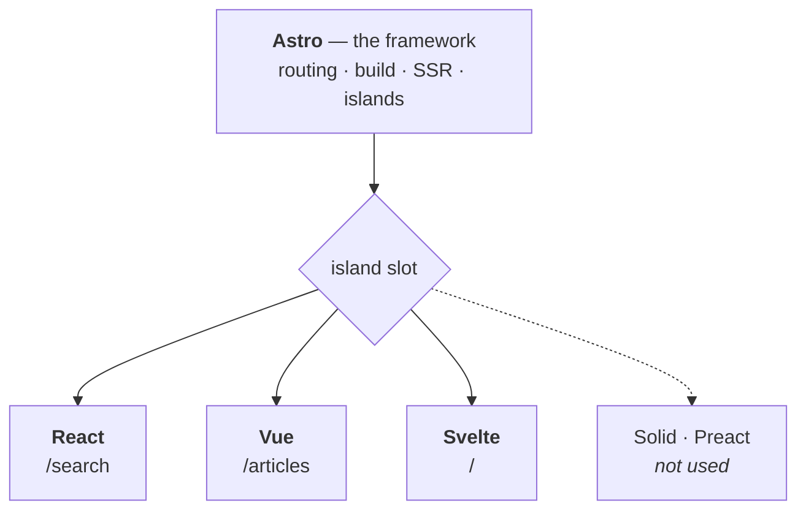

# Frontend — Astro

[](https://astro.build)
[](https://react.dev)
[](https://vuejs.org)
[](https://svelte.dev)
[](https://www.typescriptlang.org)
[](https://tailwindcss.com)
[](https://vercel.com)

**English** · [Bahasa Indonesia](README.id.md)

Astro frontend for the [Fullstack Headless CMS](../README.md) — the public website that consumes published content from Strapi through the REST API.

> [!NOTE]
> Project-wide context — goal, system architecture, tech stack, environment variables, code quality, and the implementation phases — lives in the [root README](../README.md).

---

## Table of Contents

- [Architecture: Astro vs UI Frameworks](#architecture-astro-vs-ui-frameworks)
- [Routing](#routing)
- [Theme](#theme)
- [Development gotchas](#development-gotchas)
- [Core Features](#core-features)
- [SEO](#seo)
- [Error Handling](#error-handling)

---

## Architecture: Astro vs UI Frameworks

This frontend is an **Astro** application — not a React SPA and not Next.js. React, Vue and Svelte are integrations that Astro loads for the handful of components which genuinely need browser interactivity.

So `components/astro/` and the framework folders beside it are not equal choices. They are **default and exception**.

### Who owns what

`.astro` is **not** React. Astro has its own component language; a UI framework only enters the picture when you create a `.tsx`, `.vue` or `.svelte` file.

Astro owns the framework layer — file-based routing from `src/pages/`, the build (Vite underneath), server rendering, and the islands mechanism itself. React, Vue and Svelte own nothing except the interactive components you explicitly hand them.



That slot is what separates Astro from every other meta-framework:

| Meta-framework | Locked to |
|---|---|
| Next.js | React only |
| Nuxt | Vue only |
| SvelteKit | Svelte only |
| **Astro** | any of them — and several at once |

So only Astro is load-bearing here:

| Technology | Role | Replaceable? |
|---|---|---|
| **Astro** | Framework — routing, build, SSR, islands | No — it *is* the architecture |
| **React / Vue / Svelte** | UI libraries for interactive islands | Yes — any of them, or none |
| **TypeScript** | Language, across `.astro` and framework components | — |
| **Tailwind** | Styling | Yes |

### One framework per page

Three frameworks are a deliberate choice: they demonstrate that Astro's islands are framework-agnostic. That demonstration is only worth making if it costs the visitor nothing.

> [!WARNING]
> Each framework ships its **own** runtime, and none of it is shared. Two frameworks on one page means the visitor downloads both. Islands of different frameworks must never appear on the same page.

| Page | Island | Framework | JS shipped (gzip) |
|---|---|---|---|
| `/search` | `SearchBox.tsx` — search box + live results | React | 60.4 kB |
| `/articles` | `ArticleFilter.vue` — category & tag filter | Vue | 29.3 kB |
| `/articles/[slug]` | `ReadingTools.svelte` — table of contents, reading progress, copy-code | Svelte | 16.1 kB |
| `/` | — | — | **0 kB** |
| `/categories/[slug]` | — | — | **0 kB** |
| `/tags/[slug]` | — | — | **0 kB** |
| `/authors/[slug]` | — | — | **0 kB** |
| `/404` | — | — | **0 kB** |

Those figures are measured from the build output, not estimated. They are also the reason each framework sits where it does: the article page is the one visitors actually read, so it gets the lightest runtime available. React on that page would cost roughly four times as much.

> [!CAUTION]
> Watch for **global islands**. Anything in the shared header or footer — a mobile navigation toggle, for instance — appears on every page and would collide with all three frameworks at once. Build shared-layout interactivity as an `.astro` component with plain JavaScript instead.

### The difference

| | `components/astro/*.astro` | framework components |
|---|---|---|
| Rendered | On the server only | On the server, then revived in the browser |
| JavaScript shipped | **0 kB** | Framework runtime + component code |
| Local state / event handlers | Not available | Available |
| Use for | Displaying content | Responding to user input |

An `.astro` component is an HTML template. It runs once on the server, emits finished HTML, and its own code never reaches the browser — which is precisely why it cannot hold state or event handlers.

### Where each component belongs

```text
components/
├── astro/                    # the majority live here
│   ├── BaseHead.astro        # SEO meta tags
│   ├── Header.astro
│   ├── ArticleCard.astro     # title, image, excerpt, link
│   ├── AuthorBox.astro
│   ├── TagList.astro         # plain links
│   ├── Pagination.astro      # <a href="/articles/2">, not a button
│   └── EmptyState.astro
│
├── react/
│   └── SearchBox.tsx         # /search — types a query, results update live
│
├── vue/
│   └── ArticleFilter.vue     # /articles — picks a category, list narrows
│
└── svelte/
    └── TopicExplorer.svelte  # / — browses popular topics
```

Note `Pagination.astro`. Pagination only needs `<a href="/articles/2">` — real links are crawlable and open in a new tab, so reaching for a framework would make it worse, not better.

`SearchBox.tsx` is the opposite case: results must change as the user types, with no page reload. That is impossible without JavaScript in the browser, so a framework earns its place.

### How they meet

```astro
---
// src/pages/search.astro — this frontmatter runs on the SERVER
import Layout from '../layouts/BaseLayout.astro';
import ArticleCard from '../components/astro/ArticleCard.astro';
import SearchBox from '../components/react/SearchBox.tsx';
import { getArticles } from '../services/strapi/articles';

const articles = await getArticles();   // hits Strapi from the server, not the browser
---

<Layout title="Search">
  <SearchBox client:visible />

  {articles.map((a) => <ArticleCard article={a} />)}
</Layout>
```

### Hydration, not client rendering

Framework components here are **not** rendered from scratch in the browser:

1. Astro renders the component to finished HTML **on the server**
2. That HTML reaches the browser complete and visible
3. Only if a `client:*` directive is present does the JavaScript follow and revive it

So `<SearchBox client:visible />` exists in the HTML source before any JavaScript loads — crawlers and users see it immediately. A true client-rendered SPA would ship an empty `<div id="root"></div>` instead, which is what hurts SEO.

> [!IMPORTANT]
> A framework component **without** a `client:*` directive still renders to static HTML and ships **no** JavaScript. The directive is what sends JavaScript — not the file extension.
>
> ```astro
> <SearchBox />                 <!-- inert HTML, 0 kB JS -->
> <SearchBox client:visible />  <!-- interactive, JS loads when scrolled into view -->
> ```

Each island is an independent root with its own lifecycle. They hydrate separately and share no state by default — and across frameworks, they cannot share state at all.

For choosing between `client:load`, `client:idle` and `client:visible`, see [Islands](../README.md#islands) in the root README.

### The rule

Before creating a component, ask one question:

> Does something have to change on screen without navigating to another page?

**No → `.astro`. Yes → a framework component, in whichever framework that page already owns.**

Expect roughly a dozen Astro components against three framework ones. The homepage, category, tag, author and 404 pages ship **0 kB of JavaScript**; the article page ships 16.1 kB because it carries the reading tools.

## Routing

| File | URL | Rendering |
|---|---|---|
| `pages/index.astro` | `/` | prerendered |
| `pages/articles/index.astro` | `/articles` | prerendered — full archive, filtered client-side |
| `pages/articles/page/[page].astro` | `/articles/page/2`, … | prerendered — overflow past 100 articles |
| `pages/articles/[slug].astro` | `/articles/<slug>` | prerendered, one per article |
| `pages/categories/[slug].astro` | `/categories/<slug>` | prerendered, one per category |
| `pages/tags/[slug].astro` | `/tags/<slug>` | prerendered, one per tag |
| `pages/authors/[slug].astro` | `/authors/<slug>` | prerendered, one per author |
| `pages/404.astro` | `/404` | prerendered |
| `pages/search.astro` | `/search` | **on demand** — `prerender = false` |
| `pages/api/search.ts` | `/api/search?q=` | **on demand** — JSON, proxies Strapi |

Everything except `/search` and `/api/search` is generated from Strapi at build time, so the page count follows the content. Those two are the only routes that need Strapi alive at request time; they depend on `?q=`, which cannot be known at build.

> [!WARNING]
> **Pagination deliberately lives under `/articles/page/`, not `/articles/[...page]`.**
>
> A rest route (`[...page].astro`) placed next to `[slug].astro` in the same directory claims the whole `/articles/*` space, including article slugs. The static build hides this — both paths are generated explicitly and never compete — but the dev server matches routes dynamically, and there the rest route wins. The symptom is a 404 on every article detail page in `npm run dev` while `npm run build` produces those exact pages without complaint.
>
> Keeping the two in separate directories removes the ambiguity entirely.

---

## Theme

This site is the blog section of an existing Next.js portfolio, so its theme is matched to it rather than designed independently.

| Token | Value |
|---|---|
| Background | `#030712` (gray-950) |
| Foreground | `#f9fafb` (gray-50) |
| Font | Geist Variable / Geist Mono Variable, self-hosted |
| Cards | `bg-gray-900`, `border-gray-700`, `rounded-lg` |
| Content area | gradient `from-gray-900 to-gray-800` |

> [!IMPORTANT]
> The site is **dark-only**. There are no `dark:` variants anywhere, and adding one would break the match — the portfolio has no light mode to match against.

Fonts are self-hosted through `@fontsource-variable/geist` rather than loaded from Google Fonts, so no render-blocking third-party request sits in front of the first paint.

Article typography (`.prose-knowly` in `src/styles/global.css`) is written by hand instead of using `@tailwindcss/typography`. Only headings, lists, blockquotes, code and images needed styling, which is not worth a dependency under the project's minimal-dependencies rule.

---

## Development gotchas

Two failure modes cost real debugging time on this project. Both look like code bugs and are not.

### Route files need a dev-server restart

Adding or deleting a file under `src/pages/` while `npm run dev` is running can leave the route table stale. The symptom is a `404` on a page that `npm run build` generates without complaint.

```bash
pkill -f 'astro dev'
lsof -nP -iTCP:4321 -sTCP:LISTEN   # must be empty
npm run dev
```

The `lsof` check matters: closing the terminal does not always kill the process, and a surviving one keeps serving the old routes.

### A new UI framework needs the Vite cache cleared

After installing an integration (React, Vue, Svelte) into a project that has already run in dev, Vite's pre-bundled dependency cache can be stale. The island then renders from the server, hydrates, and disappears — because the framework is loaded twice at runtime and hooks break.

```bash
pkill -f 'astro dev'
rm -rf node_modules/.vite
npm run dev
```

The tell is that the server HTML contains the component but the browser shows nothing after a moment. If clearing the cache does not fix it, the browser console will name the real error — `Invalid hook call`, a hydration mismatch, or something thrown inside the component.

---

## Core Features

### Public Website

<table>
<tr><td valign="top">

**Homepage**

- Hero section
- Featured articles
- Latest articles
- Categories
- Popular topics

</td><td valign="top">

**Article Listing**

- Article cards
- Pagination
- Category filter
- Tag filter
- Search

</td><td valign="top">

**Article Detail**

- Title
- Cover image
- Author
- Published date
- Category
- Tags
- Article content
- Related articles
- SEO metadata

</td></tr>
<tr><td valign="top">

**Category Page**

- Category information
- Articles belonging to category

</td><td valign="top">

**Tag Page**

- Articles associated with tag

</td><td valign="top">

**Author Page**

- Author information
- Author articles

</td></tr>
<tr><td valign="top" colspan="3">

**Search**

- Search articles
- Empty state
- Error state

</td></tr>
</table>

---

## SEO

Create reusable Astro SEO handling.

**Support**

- Page title
- Meta description
- Canonical URL
- Open Graph title
- Open Graph description
- Open Graph image
- Article metadata

Generate metadata from Strapi's SEO component.

Article pages must have unique metadata.

---

## Error Handling

Every case below was exercised against a real Strapi outage, not a simulated one.

### When Strapi is unavailable

| Path | Behaviour | Why |
|---|---|---|
| Build | **Fails loudly** with the typed `StrapiError` message | A build that half-succeeds would publish article pages with no article in them |
| `/` and `/articles` (dev) | `200` with a friendly notice | Both wrap their fetches and render `ErrorState` |
| `/api/search` | `503`, *"Pencarian sedang tidak tersedia."* | No status code, hostname or stack trace reaches the browser |
| `/articles/[slug]` and archive pages (dev) | `500` | Deliberate — see below |
| **All content pages in production** | **Unaffected** | They are static files; only `/search` needs Strapi alive at request time |

That last row is worth naming: because content pages are prerendered, a Strapi outage is invisible to visitors in production. It can only break a build or the search page.

### Why prerendered pages have no try/catch

`/articles/[slug]`, `/categories/[slug]`, `/tags/[slug]` and `/authors/[slug]` deliberately let errors propagate.

Wrapping them would make the build **succeed** and ship empty article pages. A failed build is recoverable; a site that looks fine while being empty is not. The `500` they return in dev is a developer-facing signal, and it should stay loud.

### Input validation on `/api/search`

| Query | Response |
|---|---|
| empty or 1 character | `200` with `tooShort: true` — no database work |
| 2–80 characters | `200` with results |
| over 80 characters | `400` — long queries only load the database for nothing |

### Missing images

Cover images, feed thumbnails and author avatars carry an inline `onerror` that removes the broken element. Thumbnail containers keep a gradient background, so a failed image leaves a tidy placeholder instead of a hole.

That is a plain HTML attribute, not an island — it costs **0 kB**.

### Components

| Component | Handles |
|---|---|
| `ErrorState.astro` | Strapi unreachable — friendly wording, no technical detail |
| `EmptyState.astro` | No articles in a category, tag, author, or filter result |
| `404.astro` | Unknown route or unknown slug |
| `client.ts` | 10-second timeout, typed `StrapiError`, normalised messages |

> [!CAUTION]
> Internal error detail never reaches the visitor. `client.ts` converts every failure into a `StrapiError` with a safe message, and the pages render fixed wording rather than the thrown text.
